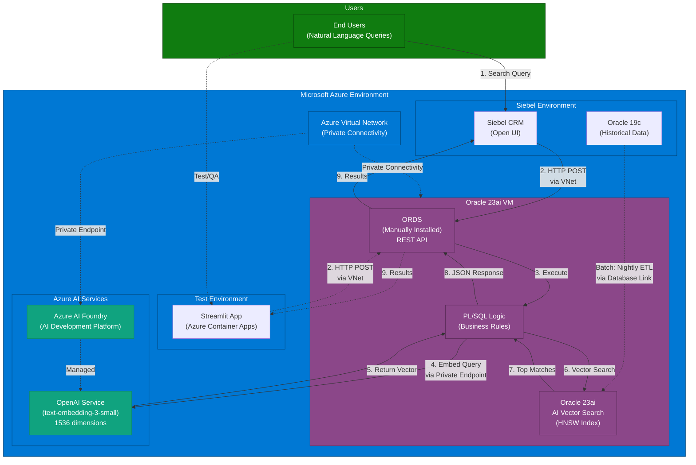

# Siebel CRM AI-Powered Semantic Search

**Project Status:** In Development (Version 2.1)

## 1. Overview
This project replaces the legacy keyword-based service catalog search in Siebel CRM with a modern, AI-powered semantic search engine. The solution understands the user's intent behind natural language queries, analyzes historical service request data, and provides intelligent, relevant recommendations for service catalog items. This significantly improves search accuracy, reduces request miscategorization, and enhances the overall user experience.

The architecture is built on the Oracle ecosystem, leveraging **Oracle Database 23ai on Azure VM** for its powerful AI Vector Search capabilities. Oracle 23ai provides native vector search functionality with HNSW indexing, eliminating the need for specialized vector databases while maintaining enterprise-grade performance and security. ORDS (Oracle REST Data Services) is installed on the same VM to provide a high-performance, database-native API layer.

## 2. Key Features
- **Natural Language Understanding:** Interprets the *meaning* and *intent* of user queries, not just keywords.
- **High-Relevance Recommendations:** Uses vector similarity search to find the most relevant historical service requests and suggests the most appropriate catalog items.
- **100% Azure-Native Architecture:** Built entirely on Microsoft Azure infrastructure:
  - Oracle Database 23ai on Azure VM for vector storage and native AI Vector Search
  - Azure AI Foundry with OpenAI Service for text embeddings (1536 dimensions)
  - Azure Container Apps for test application hosting
  - Azure Virtual Network for secure, low-latency connectivity
- **Enterprise-Grade Performance:** Oracle 23ai delivers:
  - Native HNSW vector indexing for sub-50ms query times
  - Proven scalability for millions of vectors
  - ACID compliance and enterprise reliability
  - Direct PL/SQL integration with vector operations
- **Cost-Effective AI Platform:** Azure AI Foundry with OpenAI embeddings provides:
  - Unified AI development platform (prompt flow, evaluation, monitoring)
  - Competitive pricing with flexible consumption models
  - Enterprise-grade governance and responsible AI tools
  - Integrated model management and deployment
- **Flexible Deployment:** Self-managed VM provides full control over:
  - Database configuration and tuning
  - ORDS customization and scaling
  - Backup and recovery strategies
  - Resource allocation
- **Secure & Performant:** 
  - Enterprise-grade security with TLS encryption
  - All traffic stays within Azure VNet
  - API logic co-located with data for optimal performance
- **Seamless Siebel Integration:** Integrates directly into the Siebel Open UI, providing a modern search experience without leaving the application.

## 3. High-Level Architecture

### 3.1. System Overview

### 3.2. Data Flows

The solution consists of two main flows:

1.  **Offline Indexing (Batch Process):** A nightly job extracts historical data from the Siebel Oracle 19c database via database links, converts text narratives into 1536-dimensional vectors using **Azure AI Foundry's OpenAI Service** (text-embedding-3-small or text-embedding-3-large), and stores them in the Oracle 23ai vector database with HNSW algorithm for fast similarity search. All communication stays within the Azure VNet, with Azure AI Foundry accessed via private endpoints for secure, low-latency data transfer.

2.  **Real-Time Search (User Query):** When a user enters a natural language query in the Siebel UI, an eScript makes an HTTP POST request to the ORDS REST endpoint running on the Oracle 23ai VM (typically `http://localhost:8080/ords` or `http://<vm-ip>:8080/ords`). A PL/SQL procedure (`GET_SEMANTIC_RECOMMENDATIONS`) converts the user's query to a vector using **Azure AI Foundry's OpenAI Service**, performs a cosine similarity search using `VECTOR_DISTANCE` against the HNSW index, aggregates results by catalog item frequency, and returns a ranked JSON list of the top 5 recommendations. All traffic remains within Azure VNet for optimal performance and security.

### 3.3. Detailed Architecture Diagrams

For comprehensive visual documentation including component diagrams, data flow sequences, network topology, security architecture, deployment patterns, and vector search internals, see:

- **[Complete Architecture Diagrams](docs/ARCHITECTURE_DIAGRAMS.md)** - Comprehensive visual documentation with 20+ Mermaid diagrams
- **[Project Architecture Guide](docs/Project%20Architecture.md)** - Detailed system architecture with embedded diagrams

## 4. Project Documentation
All technical design documents, deployment guides, and testing plans are located in the `/docs` directory.

| Document | Description |
| :--- | :--- |
| [**Project Architecture**](docs/Project%20Architecture.md) | A detailed overview of the system architecture, components, data flow, and non-functional requirements. |
| [**TDD 1: Data Extraction**](docs/TDD%201%20-%20Data%20Extraction%20and%20Preparation.md) | Technical specification for the SQL-based data extraction and aggregation process from the source Siebel database. |
| [**TDD 2: Vector Database & Indexing**](docs/TDD%202%20-%20Vector%20Database%20and%20Indexing%20Pipeline.md) | Design of the vector database schema, indexing pipeline, and the process for generating embeddings. |
| [**TDD 3: Semantic Search API**](docs/TDD%203%20-%20Semantic%20Search%20API.md) | Specification for the ORDS-based REST API, including the PL/SQL logic for handling search requests. |
| [**TDD 4: Siebel CRM Integration**](docs/TDD%204%20-%20Siebel%20CRM%20Integration.md) | Details on the Siebel Open UI modifications, business services, and eScripting required to integrate the search API. |
| [**TDD 5: Standalone Test Application**](docs/TDD%205%20-%20Standalone%20Test%20Application.md) | Design specification for a Python-based test application with UI for testing semantic search independently of Siebel. |
| [**Deployment Guide**](docs/Deployment%20Guide.md) | Step-by-step instructions for deploying the entire solution into a target environment. |
| [**Testing Guide**](docs/Testing%20Guide.md) | The comprehensive testing strategy, including unit, integration, performance, and user acceptance testing. |
| [**Project Evolution Roadmap**](docs/PROJECT_EVOLUTION_ROADMAP.md) | Multi-year evolution plan showing how to enhance the baseline system with LLM reasoning, microservices, AI agents, hybrid search, and knowledge graphs - all building on the Oracle Autonomous Database foundation. |

## 5. Terminology Reference

To ensure consistency across all documentation and communication, this section defines the standard terminology used throughout the project.

### 5.1. Core Components

| Term | Standard Usage | Alias/Variations | Description |
|------|---------------|------------------|-------------|
| **Oracle Database 23ai on Azure VM** | Vector database, primary data store | "Oracle 23ai", "Vector DB", "Oracle 23ai Database" | Self-managed Oracle Database 23ai installation on Azure VM for vector storage and AI Vector Search with HNSW indexing |
| **Oracle 19c (Siebel database)** | Source system, legacy database | "Siebel DB", "Oracle 19c" | Production Oracle 19c database hosting Siebel CRM application data with 10 years of historical service requests |
| **ORDS REST API** | API layer, REST endpoint | "ORDS", "ORDS API", "API layer", "Oracle REST Data Services (ORDS)" | Manually installed Oracle REST Data Services 23.3.0 on the Oracle 23ai VM providing HTTP/HTTPS REST endpoints on port 8080/443 |
| **Azure AI Foundry with OpenAI Service** | Embedding service, AI platform | "Azure AI Foundry", "OpenAI Service", "Azure OpenAI", "AI Foundry workspace" | Microsoft Azure's unified AI development platform providing OpenAI models for text embeddings (text-embedding-3-small, 1536 dimensions) |
| **Streamlit test application** | Test application, validation tool | "Streamlit app", "Test app", "Standalone test app", "Python test app" | Python-based web application hosted on Azure Container Apps for testing semantic search functionality independent of Siebel CRM |

### 5.2. Technical Terms

| Term | Definition | Context |
|------|------------|---------|
| **Vector Embedding** | A 1536-dimensional numerical array (FLOAT32) representing the semantic meaning of text | Generated by Azure AI Foundry's text-embedding-3-small model |
| **HNSW Index** | Hierarchical Navigable Small World graph-based vector index | Oracle 23ai's native vector indexing algorithm for sub-50ms similarity searches |
| **Cosine Similarity** | Mathematical measure of similarity between two vectors (range: -1 to 1) | Used in `VECTOR_DISTANCE` function with `COSINE` distance metric |
| **Database Link** | Oracle database connection from Oracle 23ai to Oracle 19c (Siebel) | Named `SIEBEL_19C_LINK`, used for ETL data extraction |
| **Private Endpoint** | Azure networking feature for secure, private connectivity to PaaS services | Used to connect Oracle 23ai VM to Azure AI Foundry without internet exposure |
| **NSG (Network Security Group)** | Azure firewall rules controlling inbound/outbound traffic to subnets/VMs | Configured for database subnet (10.0.3.0/24) with rules for ports 22, 1521, 8080, 443 |
| **Service Request (SR)** | Siebel CRM entity representing customer support tickets | Primary data source with fields: SR_NUM, ABSTRACT, DESCRIPTION, CATALOG_NAME |
| **Catalog Item** | Siebel service catalog entry representing standardized service offerings | Target of semantic search recommendations |

### 5.3. Architecture Layers

| Layer | Components | Responsibility |
|-------|-----------|----------------|
| **Presentation Layer** | Siebel Open UI, Streamlit test app | User interface, query input, results display |
| **API Layer** | ORDS REST API (port 8080/443) | HTTP endpoint, request validation, response formatting |
| **Business Logic Layer** | PL/SQL procedures (`GET_SEMANTIC_RECOMMENDATIONS`, `GENERATE_EMBEDDINGS_BATCH`) | Query embedding, vector search, ranking, aggregation |
| **Data Layer** | Oracle 23ai with AI Vector Search | Vector storage, HNSW indexing, cosine similarity search |
| **AI/ML Layer** | Azure AI Foundry with OpenAI Service | Text-to-vector embedding generation (1536 dimensions) |
| **Integration Layer** | Database link (SIEBEL_19C_LINK), Azure Private Endpoint | Data extraction from Siebel, secure AI API connectivity |

### 5.4. Performance Metrics

| Metric | Definition | Target Value |
|--------|------------|--------------|
| **Query Latency (P50)** | Median end-to-end search response time | < 1.0 second |
| **Query Latency (P95)** | 95th percentile response time (95% of queries faster than this) | < 3.0 seconds |
| **Query Latency (P99)** | 99th percentile response time | < 5.0 seconds |
| **Vector Search Time** | Database-only vector similarity search (excludes embedding API call) | < 50 milliseconds |
| **Embedding API Call** | Time to generate query vector via Azure AI Foundry | 200-500 milliseconds |
| **Throughput** | Maximum concurrent queries per second | 50-100 requests/second |
| **Index Refresh Time** | Duration to rebuild complete HNSW vector index | < 30 minutes (1M vectors) |

### 5.5. Security & Network

| Term | Definition | Example/Value |
|------|------------|---------------|
| **Azure VNet** | Virtual Network isolating all Azure resources | CIDR: 10.0.0.0/16 |
| **Management Subnet** | Subnet for Azure Bastion and jump boxes | 10.0.1.0/24 |
| **Siebel Subnet** | Subnet hosting Siebel CRM VMs | 10.0.2.0/24 |
| **Database Subnet** | Subnet hosting Oracle 23ai VM | 10.0.3.0/24 |
| **Application Subnet** | Subnet for test apps (Container Apps) | 10.0.4.0/24 |
| **AI Foundry Subnet** | Subnet for Private Endpoints to Azure AI Foundry | 10.0.5.0/24 |
| **TLS/SSL** | Transport Layer Security for HTTPS encryption | ORDS configured with certificate on port 443 |
| **API Key** | Authentication token for Azure AI Foundry OpenAI Service | Stored in Oracle credential: `AZURE_AI_FOUNDRY_CRED` |

### 5.6. Data Processing

| Term | Definition | Schedule/Volume |
|------|------------|----------------|
| **ETL (Extract, Transform, Load)** | Batch process extracting historical data from Siebel to Oracle 23ai | Nightly at 2:00 AM |
| **Embedding Generation** | Converting text to 1536-dimensional vectors | Batch process, 1000 records per batch |
| **Vector Indexing** | Creating/refreshing HNSW index on embeddings | After ETL completion, ~30 minutes for 1M records |
| **Data Volume** | Historical service requests | 10 years, ~1 million records |
| **Batch Size** | Records processed per embedding API call | 1-1000 records (configurable) |
| **Text Limit** | Maximum characters per embedding request | 8000 characters (Azure OpenAI text-embedding-3-small) |

### 5.7. Development & Deployment

| Term | Definition | Values |
|------|------------|--------|
| **Environment** | Deployment target for the solution | DEV, UAT, PROD |
| **VM SKU** | Azure Virtual Machine size | Standard_D8s_v3 (8 vCPUs, 32 GB RAM) for PROD |
| **Storage** | Managed disks for database and backups | Premium SSD: 512 GB (data), 256 GB (backup) |
| **ORDS Mode** | Deployment mode for Oracle REST Data Services | Jetty Standalone (port 8080) |
| **Database Edition** | Oracle Database edition | Enterprise Edition (required for AI Vector Search) |
| **Oracle Home** | Oracle software installation directory | `/u01/app/oracle/product/23.0.0/dbhome_1` |
| **Connection Pool** | ORDS database connection pool size | 10-50 connections (environment-dependent) |

### 5.8. Common Acronyms

| Acronym | Full Term | Context |
|---------|-----------|---------|
| **ORDS** | Oracle REST Data Services | API layer providing HTTP/HTTPS endpoints |
| **HNSW** | Hierarchical Navigable Small World | Vector indexing algorithm for fast similarity search |
| **ETL** | Extract, Transform, Load | Batch data processing from Siebel to Oracle 23ai |
| **VM** | Virtual Machine | Azure compute resource hosting Oracle 23ai |
| **VNet** | Virtual Network | Azure networking construct for resource isolation |
| **NSG** | Network Security Group | Azure firewall rules for network traffic control |
| **TLS** | Transport Layer Security | Encryption protocol for HTTPS |
| **SSL** | Secure Sockets Layer | Legacy term for TLS encryption |
| **SR** | Service Request | Siebel CRM entity (customer support ticket) |
| **API** | Application Programming Interface | REST API exposed by ORDS |
| **JSON** | JavaScript Object Notation | Data format for API requests/responses |
| **PL/SQL** | Procedural Language/SQL | Oracle database programming language |
| **ACL** | Access Control List | Network permissions in Oracle Database |
| **RTO** | Recovery Time Objective | Maximum acceptable downtime (4 hours target) |
| **RPO** | Recovery Point Objective | Maximum acceptable data loss (1 hour target) |
| **P50/P95/P99** | Percentile | 50th, 95th, 99th percentile performance metrics |

### 5.9. Version Information

| Component | Version | Notes |
|-----------|---------|-------|
| **Oracle Database** | 23ai (23.0.0) | Vector database with AI Vector Search |
| **Siebel Database** | Oracle 19c | Source system database |
| **ORDS** | 23.3.0 | Manually installed, Jetty standalone |
| **OpenAI Model** | text-embedding-3-small | 1536 dimensions, FLOAT32 |
| **Azure AI Foundry API** | 2024-02-15-preview | REST API version |
| **Python** | 3.11+ | For Streamlit test application |
| **Streamlit** | Latest | Web framework for test app |

### 5.10. Usage Guidelines

**When writing documentation:**
- ✅ Use full component names on first mention: "Oracle Database 23ai on Azure VM"
- ✅ Use standard abbreviated forms after first mention: "Oracle 23ai"
- ✅ Always include "with OpenAI Service" when referring to Azure AI Foundry embeddings
- ✅ Specify database link name: "SIEBEL_19C_LINK" (not "SIEBEL_12C_LINK")
- ✅ Use "Oracle 19c (Siebel database)" to distinguish from Oracle 23ai

**When referring to performance:**
- ✅ Always specify percentile: "P95 latency < 3 seconds"
- ✅ Include context: "Vector search time < 50ms (database-only, excludes API call)"
- ✅ State measurement conditions: "1M vectors, 100 concurrent users"

**When documenting network:**
- ✅ Include subnet CIDR: "Database Subnet (10.0.3.0/24)"
- ✅ Specify port numbers: "ORDS REST API (port 8080 or 443)"
- ✅ Mention connectivity: "via Azure Private Endpoint" or "via VNet"

---

**For questions about terminology or to suggest additions to this reference, please contact the technical documentation team.**
