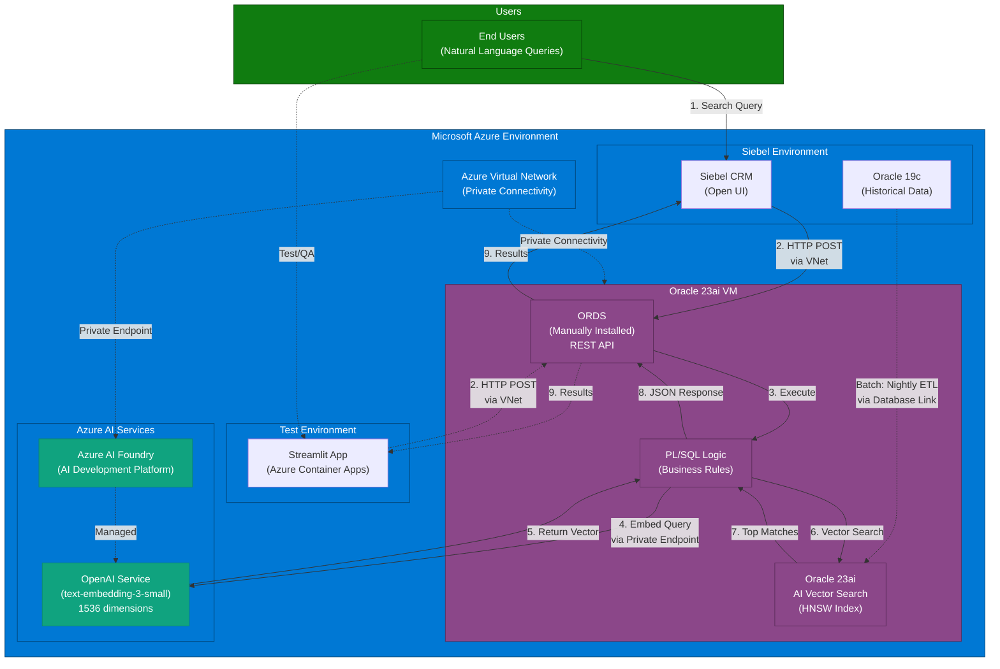

# Siebel CRM AI-Powered Semantic Search

**Project Status:** In Development (Version 2.1)

## 1. Overview
This project replaces the legacy keyword-based service catalog search in Siebel CRM with a modern, AI-powered semantic search engine. The solution understands the user's intent behind natural language queries, analyzes historical service request data, and provides intelligent, relevant recommendations for service catalog items. This significantly improves search accuracy, reduces request miscategorization, and enhances the overall user experience.

The architecture is built on the Oracle ecosystem, leveraging **Oracle Database 23ai on Azure VM** for its powerful AI Vector Search capabilities. Oracle 23ai provides native vector search functionality with HNSW indexing, eliminating the need for specialized vector databases while maintaining enterprise-grade performance and security. ORDS (Oracle REST Data Services) is installed on the same VM to provide a high-performance, database-native API layer.

## 2. Key Features
- **Natural Language Understanding:** Interprets the *meaning* and *intent* of user queries, not just keywords.
- **High-Relevance Recommendations:** Uses vector similarity search to find the most relevant historical service requests and suggests the most appropriate catalog items.
- **100% Azure-Native Architecture:** Built entirely on Microsoft Azure infrastructure:
  - Oracle Database 23ai on Azure VM for vector storage and native AI Vector Search
  - Azure AI Foundry with OpenAI Service for text embeddings (1536 dimensions)
  - Azure Container Apps for test application hosting
  - Azure Virtual Network for secure, low-latency connectivity
- **Enterprise-Grade Performance:** Oracle 23ai delivers:
  - Native HNSW vector indexing for sub-50ms query times
  - Proven scalability for millions of vectors
  - ACID compliance and enterprise reliability
  - Direct PL/SQL integration with vector operations
- **Cost-Effective AI Platform:** Azure AI Foundry with OpenAI embeddings provides:
  - Unified AI development platform (prompt flow, evaluation, monitoring)
  - Competitive pricing with flexible consumption models
  - Enterprise-grade governance and responsible AI tools
  - Integrated model management and deployment
- **Flexible Deployment:** Self-managed VM provides full control over:
  - Database configuration and tuning
  - ORDS customization and scaling
  - Backup and recovery strategies
  - Resource allocation
- **Secure & Performant:** 
  - Enterprise-grade security with TLS encryption
  - All traffic stays within Azure VNet
  - API logic co-located with data for optimal performance
- **Seamless Siebel Integration:** Integrates directly into the Siebel Open UI, providing a modern search experience without leaving the application.

## 3. High-Level Architecture

### 3.1. System Overview

### 3.2. Data Flows

The solution consists of two main flows:

1.  **Offline Indexing (Batch Process):** A nightly job extracts historical data from the Siebel Oracle 19c database via database links, converts text narratives into 1536-dimensional vectors using **Azure AI Foundry's OpenAI Service** (text-embedding-3-small or text-embedding-3-large), and stores them in the Oracle 23ai vector database with HNSW algorithm for fast similarity search. All communication stays within the Azure VNet, with Azure AI Foundry accessed via private endpoints for secure, low-latency data transfer.

2.  **Real-Time Search (User Query):** When a user enters a natural language query in the Siebel UI, an eScript makes an HTTP POST request to the ORDS REST endpoint running on the Oracle 23ai VM (typically `http://localhost:8080/ords` or `http://<vm-ip>:8080/ords`). A PL/SQL procedure (`GET_SEMANTIC_RECOMMENDATIONS`) converts the user's query to a vector using **Azure AI Foundry's OpenAI Service**, performs a cosine similarity search using `VECTOR_DISTANCE` against the HNSW index, aggregates results by catalog item frequency, and returns a ranked JSON list of the top 5 recommendations. All traffic remains within Azure VNet for optimal performance and security.

### 3.3. Detailed Architecture Diagrams

For comprehensive visual documentation including component diagrams, data flow sequences, network topology, security architecture, deployment patterns, and vector search internals, see:

- **[Complete Architecture Diagrams](docs/ARCHITECTURE_DIAGRAMS.md)** - Comprehensive visual documentation with 20+ Mermaid diagrams
- **[Project Architecture Guide](docs/Project%20Architecture.md)** - Detailed system architecture with embedded diagrams

## 4. Project Documentation
All technical design documents, deployment guides, and testing plans are located in the `/docs` directory.

| Document | Description |
| :--- | :--- |
| [**Project Architecture**](docs/Project%20Architecture.md) | A detailed overview of the system architecture, components, data flow, and non-functional requirements. |
| [**TDD 1: Data Extraction**](docs/TDD%201%20-%20Data%20Extraction%20and%20Preparation.md) | Technical specification for the SQL-based data extraction and aggregation process from the source Siebel database. |
| [**TDD 2: Vector Database & Indexing**](docs/TDD%202%20-%20Vector%20Database%20and%20Indexing%20Pipeline.md) | Design of the vector database schema, indexing pipeline, and the process for generating embeddings. |
| [**TDD 3: Semantic Search API**](docs/TDD%203%20-%20Semantic%20Search%20API.md) | Specification for the ORDS-based REST API, including the PL/SQL logic for handling search requests. |
| [**TDD 4: Siebel CRM Integration**](docs/TDD%204%20-%20Siebel%20CRM%20Integration.md) | Details on the Siebel Open UI modifications, business services, and eScripting required to integrate the search API. |
| [**TDD 5: Standalone Test Application**](docs/TDD%205%20-%20Standalone%20Test%20Application.md) | Design specification for a Python-based test application with UI for testing semantic search independently of Siebel. |
| [**Deployment Guide**](docs/Deployment%20Guide.md) | Step-by-step instructions for deploying the entire solution into a target environment. |
| [**Testing Guide**](docs/Testing%20Guide.md) | The comprehensive testing strategy, including unit, integration, performance, and user acceptance testing. |
| [**Project Evolution Roadmap**](docs/PROJECT_EVOLUTION_ROADMAP.md) | Multi-year evolution plan showing how to enhance the baseline system with LLM reasoning, microservices, AI agents, hybrid search, and knowledge graphs - all building on the Oracle Autonomous Database foundation. |
