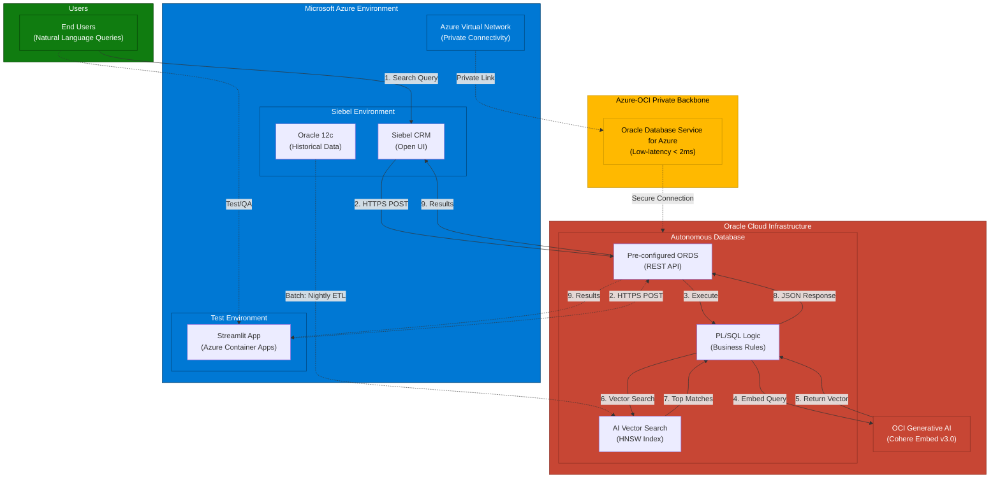

# Siebel CRM AI-Powered Semantic Search

**Project Status:** In Development (Version 2.1)

## 1. Overview
This project replaces the legacy keyword-based service catalog search in Siebel CRM with a modern, AI-powered semantic search engine. The solution understands the user's intent behind natural language queries, analyzes historical service request data, and provides intelligent, relevant recommendations for service catalog items. This significantly improves search accuracy, reduces request miscategorization, and enhances the overall user experience.

The architecture is built on the Oracle ecosystem, leveraging **Oracle Autonomous Database on Azure** for its powerful AI Vector Search capabilities with the added benefits of a fully managed PaaS solution. The managed service approach delivers enterprise-grade performance and security while significantly reducing administrative overhead. ORDS (Oracle REST Data Services) comes pre-configured within Autonomous Database, enabling rapid deployment of a high-performance, database-native API.

## 2. Key Features
- **Natural Language Understanding:** Interprets the *meaning* and *intent* of user queries, not just keywords.
- **High-Relevance Recommendations:** Uses vector similarity search to find the most relevant historical service requests and suggests the most appropriate catalog items.
- **Managed Service Architecture:** Built on Oracle Autonomous Database on Azure, providing:
  - Automatic scaling based on workload demands
  - Self-patching and self-tuning capabilities
  - Built-in high availability (99.95% SLA)
  - Reduced operational overhead and total cost of ownership
- **Rapid Deployment:** Pre-configured ORDS eliminates manual API server setup, accelerating time-to-production.
- **Secure & Performant:** 
  - Enterprise-grade security with automatic encryption and threat detection
  - Low-latency private interconnect between Azure and OCI via ODSA
  - API logic co-located with data for optimal performance
- **Seamless Siebel Integration:** Integrates directly into the Siebel Open UI, providing a modern search experience without leaving the application.

## 3. High-Level Architecture

### 3.1. System Overview

### 3.2. Data Flows

The solution consists of two main flows:

1.  **Offline Indexing (Batch Process):** A nightly job extracts historical data from the Siebel Oracle 12c database via database links, converts text narratives into 1024-dimensional vectors using the OCI Generative AI service (Cohere Embed v3.0), and stores them in the Oracle Autonomous Database vector index with HNSW algorithm for fast similarity search. The private Azure-OCI interconnect (ODSA) ensures secure, low-latency data transfer without traversing the public internet.

2.  **Real-Time Search (User Query):** When a user enters a natural language query in the Siebel UI, an eScript makes an HTTPS POST request to the pre-configured ORDS REST endpoint within Autonomous Database. A PL/SQL procedure (`GET_SEMANTIC_RECOMMENDATIONS`) converts the user's query to a vector, performs a cosine similarity search using `VECTOR_DISTANCE` against the HNSW index, aggregates results by catalog item frequency, and returns a ranked JSON list of the top 5 recommendations. The managed ORDS infrastructure provides automatic scaling and high availability (99.95% SLA).

### 3.3. Detailed Architecture Diagrams

For comprehensive visual documentation including component diagrams, data flow sequences, network topology, security architecture, deployment patterns, and vector search internals, see:

- **[Complete Architecture Diagrams](docs/ARCHITECTURE_DIAGRAMS.md)** - Comprehensive visual documentation with 20+ Mermaid diagrams
- **[Project Architecture Guide](docs/Project%20Architecture.md)** - Detailed system architecture with embedded diagrams

## 4. Project Documentation
All technical design documents, deployment guides, and testing plans are located in the `/docs` directory.

| Document | Description |
| :--- | :--- |
| [**Project Architecture**](docs/Project%20Architecture.md) | A detailed overview of the system architecture, components, data flow, and non-functional requirements. |
| [**TDD 1: Data Extraction**](docs/TDD%201%20-%20Data%20Extraction%20and%20Preparation.md) | Technical specification for the SQL-based data extraction and aggregation process from the source Siebel database. |
| [**TDD 2: Vector Database & Indexing**](docs/TDD%202%20-%20Vector%20Database%20and%20Indexing%20Pipeline.md) | Design of the vector database schema, indexing pipeline, and the process for generating embeddings. |
| [**TDD 3: Semantic Search API**](docs/TDD%203%20-%20Semantic%20Search%20API.md) | Specification for the ORDS-based REST API, including the PL/SQL logic for handling search requests. |
| [**TDD 4: Siebel CRM Integration**](docs/TDD%204%20-%20Siebel%20CRM%20Integration.md) | Details on the Siebel Open UI modifications, business services, and eScripting required to integrate the search API. |
| [**TDD 5: Standalone Test Application**](docs/TDD%205%20-%20Standalone%20Test%20Application.md) | Design specification for a Python-based test application with UI for testing semantic search independently of Siebel. |
| [**Deployment Guide**](docs/Deployment%20Guide.md) | Step-by-step instructions for deploying the entire solution into a target environment. |
| [**Testing Guide**](docs/Testing%20Guide.md) | The comprehensive testing strategy, including unit, integration, performance, and user acceptance testing. |
| [**Project Evolution Roadmap**](docs/PROJECT_EVOLUTION_ROADMAP.md) | Multi-year evolution plan showing how to enhance the baseline system with LLM reasoning, microservices, AI agents, hybrid search, and knowledge graphs - all building on the Oracle Autonomous Database foundation. |
