# Architecture Diagrams - Semantic Search Solution

**Version:** 1.0  
**Date:** October 17, 2025  
**Purpose:** Comprehensive visual documentation of system architecture

---

## Important Architecture Note

**Oracle Database 23ai on Azure VM:**

This solution uses **Oracle Database 23ai installed on Azure Virtual Machines**, providing a self-managed database deployment with full control and flexibility. This is a **100% Azure-native solution**.

**Key Points:**
- ✅ **Oracle 23ai on Azure VM** - Self-managed installation on Azure infrastructure with full administrative control
- ✅ **Azure AI Foundry with OpenAI Service** - Unified AI development platform for embeddings and future AI capabilities
- ✅ **Private connectivity** - All traffic stays within Azure VNet with Private Endpoints to AI Foundry
- ✅ **Azure-native experience** - All resources (VMs, AI Foundry, Container Apps) in your Azure subscription
- ✅ **Unified management** - Managed through Azure Portal for complete stack
- ✅ **Low latency** - Direct in-region connectivity between all components
- ✅ **100% Azure** - No cross-cloud dependencies

**AI Platform:**
- **Azure AI Foundry** - Comprehensive AI development platform (formerly Azure AI Studio)
- **OpenAI Service**: `text-embedding-3-small` (1536 dimensions) or `text-embedding-3-large` (3072 dimensions)
- **Platform Benefits**: Prompt flow, model evaluation, responsible AI tools, unified governance
- **Cost**: Competitive pricing at $0.02 per million tokens for embeddings
- **Access**: From Oracle 23ai VM via DBMS_CLOUD to Azure AI Foundry endpoint with Private Endpoint

**Database Architecture:**
- **Oracle Database 23ai** - Self-managed on Azure VM with native AI Vector Search (HNSW indexing)
- **Manual ORDS Installation** - Installed and configured on the same VM (http://localhost:8080/ords)
- **Full Control** - Complete control over configuration, tuning, patching, and resource allocation
- **Siebel Database** - Oracle 19c (corrected from 12c)

**Why This Architecture?**
- Complete control over database configuration and optimization
- Azure AI Foundry provides unified platform for current and future AI capabilities
- Simplifies networking (all components within Azure VNet)
- Flexible deployment and scaling based on specific requirements
- Lower costs with traditional Oracle licensing or BYOL options
- Single-pane-of-glass management through Azure Portal

---

## Table of Contents

1. [Overview Architecture](#1-overview-architecture)
2. [Component Architecture](#2-component-architecture)
3. [Data Flow Architecture](#3-data-flow-architecture)
4. [Network Architecture](#4-network-architecture)
5. [Security Architecture](#5-security-architecture)
6. [Deployment Architecture](#6-deployment-architecture)
7. [Vector Search Architecture](#7-vector-search-architecture)
8. [Integration Architecture](#8-integration-architecture)

---

## 1. Overview Architecture

### 1.1. System Context Diagram

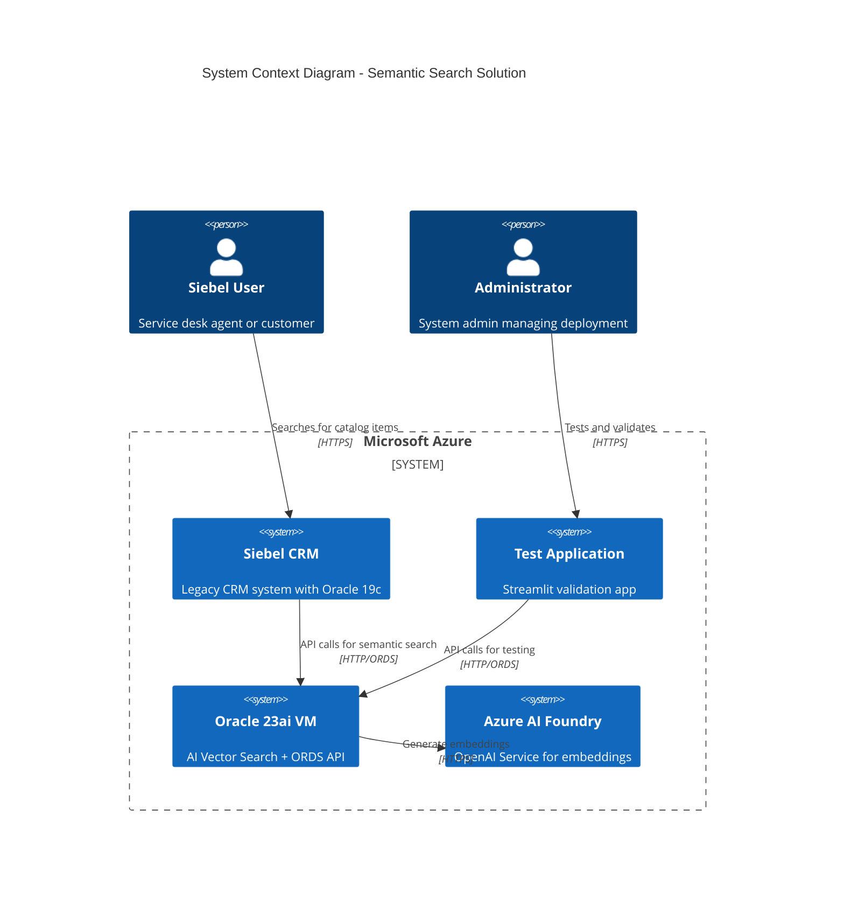

### 1.2. High-Level Architecture

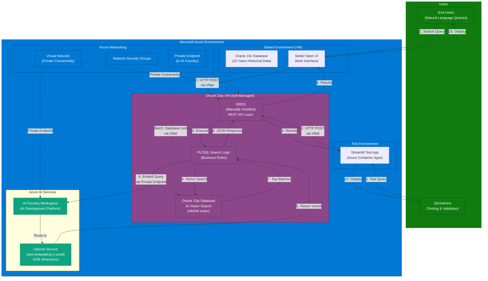

---

## 2. Component Architecture

### 2.1. Component Interaction Diagram

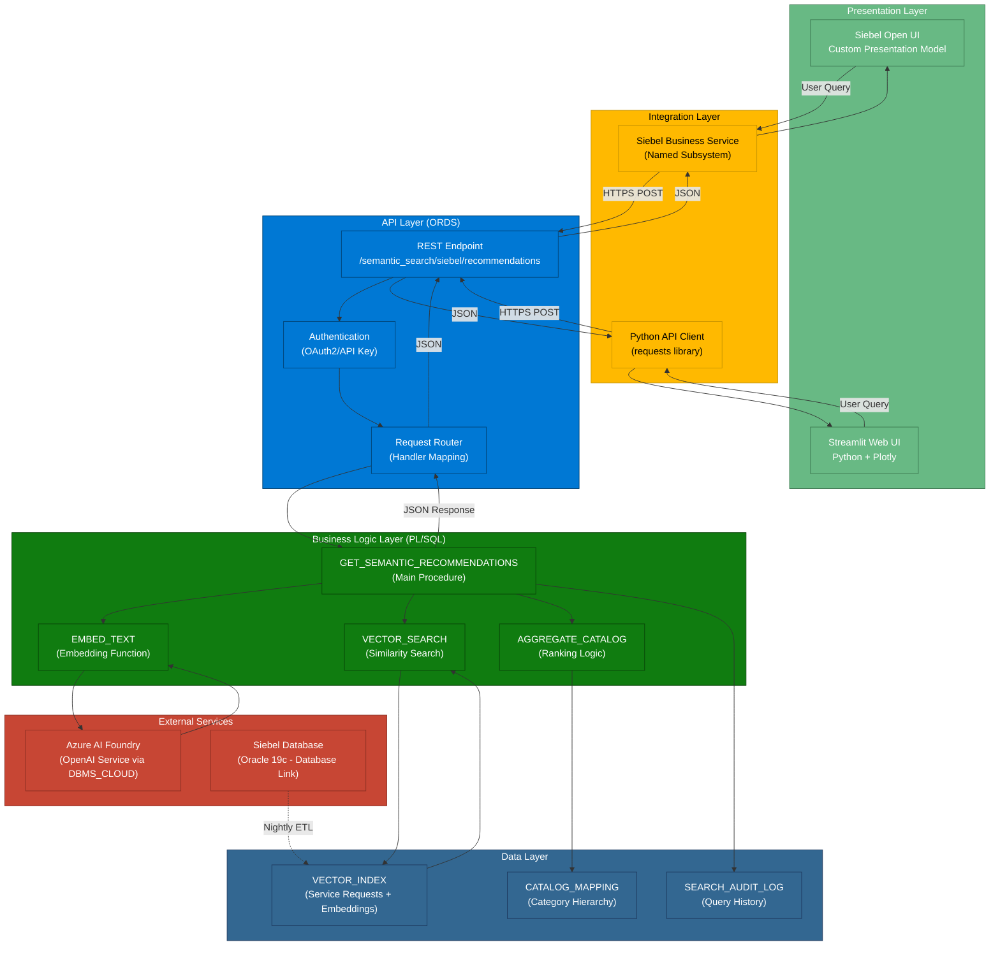

### 2.2. Technology Stack Layers

```mermaid
graph LR
    subgraph Frontend["Frontend Technologies"]
        F1["Siebel Open UI<br/>(JavaScript/eScript)"]
        F2["Streamlit<br/>(Python)"]
        F3["Plotly<br/>(Visualization)"]
    end
    
    subgraph APILayer["API Technologies"]
        A1["Oracle REST Data Services<br/>(Manually Installed)"]
        A2["JSON over HTTP<br/>(RESTful)"]
        A3["OAuth2/API Keys<br/>(Security)"]
    end
    
    subgraph DatabaseLayer["Database Technologies"]
        D1["Oracle Database 23ai<br/>(Self-Managed on Azure VM)"]
        D2["PL/SQL<br/>(Business Logic)"]
        D3["AI Vector Search<br/>(HNSW Index)"]
        D4["DBMS_CLOUD<br/>(Azure Integration)"]
    end
    
    subgraph AILayer["AI/ML Technologies"]
        AI1["Azure AI Foundry<br/>(OpenAI Service - text-embedding-3-small)"]
        AI2["Vector Embeddings<br/>(1536 dimensions)"]
        AI3["Cosine Similarity<br/>(VECTOR_DISTANCE)"]
    end
    
    subgraph Infrastructure["Infrastructure"]
        I1["Azure VMs<br/>(Siebel + Oracle 23ai)"]
        I2["Azure Container Apps<br/>(Test App)"]
        I3["Azure AI Foundry<br/>(AI Platform)"]
        I4["Azure Networking<br/>(VNet, NSG, Private Endpoints)"]
    end
    
    Frontend --> APILayer
    APILayer --> DatabaseLayer
    DatabaseLayer --> AILayer
    Infrastructure -.->|Hosts| Frontend
    Infrastructure -.->|Hosts| APILayer
    Infrastructure -.->|Hosts| DatabaseLayer
    
    classDef frontend fill:#68B984,stroke:#3D7A52,color:#fff
    classDef api fill:#0078D4,stroke:#004578,color:#fff
    classDef db fill:#336791,stroke:#1E3A5F,color:#fff
    classDef ai fill:#C74634,stroke:#8B2F23,color:#fff
    classDef infra fill:#5E5E5E,stroke:#2E2E2E,color:#fff
    
    class Frontend,F1,F2,F3 frontend
    class APILayer,A1,A2,A3 api
    class DatabaseLayer,D1,D2,D3,D4 db
    class AILayer,AI1,AI2,AI3 ai
    class Infrastructure,I1,I2,I3,I4 infra
```

---

## 3. Data Flow Architecture

### 3.1. Real-Time Search Flow (Detailed)

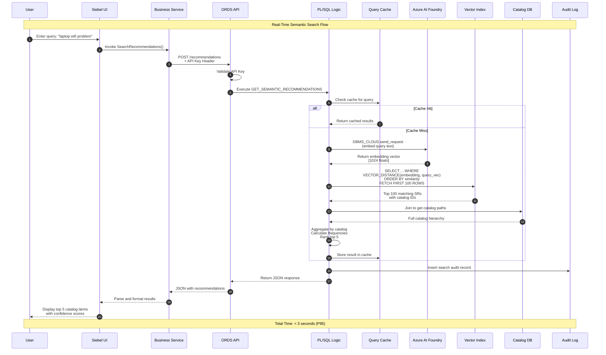

### 3.2. Batch Indexing Flow (Detailed)

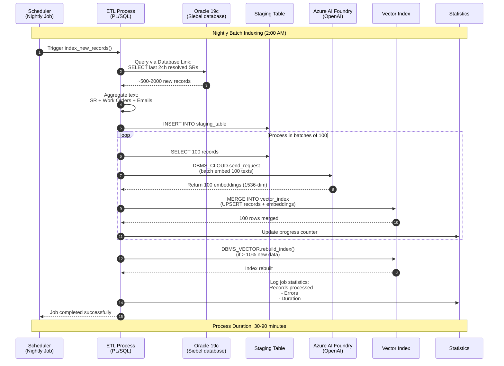

### 3.3. Data Transformation Pipeline

```mermaid
graph LR
    subgraph Source["Data Sources (Siebel Oracle 19c)"]
        SR[Service Request<br/>- Abstract<br/>- Detailed Description]
        WO[Work Orders<br/>- Action Log<br/>- Resolution Notes]
        EMAIL[Email Activities<br/>- Body Text<br/>- Attachments]
    end
    
    subgraph Extract["Extraction Layer"]
        DBLINK[Database Link<br/>SELECT with filters]
        AGG[Text Aggregation<br/>CONCAT fields]
    end
    
    subgraph Transform["Transformation Layer"]
        CLEAN[Text Cleaning<br/>- Remove HTML<br/>- Normalize whitespace]
        ENRICH[Enrichment<br/>- Add catalog path<br/>- Add metadata]
        VALIDATE[Validation<br/>- Check completeness<br/>- Filter invalid]
    end
    
    subgraph AI["AI Embedding"]
        BATCH[Batch Processing<br/>100 records/request]
        EMBED[Azure AI Foundry<br/>OpenAI text-embedding-3-small]
        VECTOR[Generate Vectors<br/>1536 dimensions]
    end
    
    subgraph Load["Load Layer"]
        STAGE[Staging Table<br/>Temporary storage]
        MERGE[MERGE Operation<br/>UPSERT logic]
        INDEX[Vector Index<br/>HNSW structure]
    end
    
    SR --> DBLINK
    WO --> DBLINK
    EMAIL --> DBLINK
    
    DBLINK --> AGG
    AGG --> CLEAN
    CLEAN --> ENRICH
    ENRICH --> VALIDATE
    
    VALIDATE --> BATCH
    BATCH --> EMBED
    EMBED --> VECTOR
    
    VECTOR --> STAGE
    STAGE --> MERGE
    MERGE --> INDEX
    
    classDef source fill:#FFB900,stroke:#C79400,color:#000
    classDef extract fill:#0078D4,stroke:#004578,color:#fff
    classDef transform fill:#68B984,stroke:#3D7A52,color:#fff
    classDef ai fill:#C74634,stroke:#8B2F23,color:#fff
    classDef load fill:#336791,stroke:#1E3A5F,color:#fff
    
    class Source,SR,WO,EMAIL source
    class Extract,DBLINK,AGG extract
    class Transform,CLEAN,ENRICH,VALIDATE transform
    class AI,BATCH,EMBED,VECTOR ai
    class Load,STAGE,MERGE,INDEX load
```

---

## 4. Network Architecture

### 4.1. Network Topology

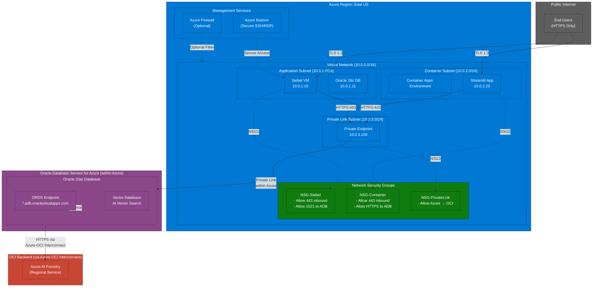

### 4.2. Traffic Flow Patterns

```mermaid
graph LR
    subgraph UserTraffic["User Traffic"]
        Browser["Web Browser"]
    end
    
    subgraph EdgeSecurity["Edge Security"]
        WAF["Web Application Firewall<br/>(Optional)"]
        DDoS["DDoS Protection"]
    end
    
    subgraph LoadBalancing["Load Balancing"]
        ALB["Application Load Balancer<br/>(Built-in)"]
    end
    
    subgraph Application["Application Tier"]
        App1["Siebel/Streamlit<br/>Instance 1"]
        App2["Siebel/Streamlit<br/>Instance 2"]
    end
    
    subgraph Network["Network Layer"]
        VNet["Azure VNet<br/>(10.0.0.0/16)"]
        NSG["Network Security Groups"]
        Route["Route Tables"]
    end
    
    subgraph PrivateLink["Private Connectivity"]
        Endpoint["Private Endpoint"]
        DNS["Private DNS Zone"]
    end
    
    subgraph Backend["Backend Services"]
        ADB["Oracle 23ai Database<br/>(via ODSA)"]
    end
    
    Browser -->|HTTPS| WAF
    WAF --> DDoS
    DDoS --> ALB
    
    ALB -->|Round Robin| App1
    ALB -->|Round Robin| App2
    
    App1 --> VNet
    App2 --> VNet
    
    VNet --> NSG
    NSG --> Route
    
    Route --> Endpoint
    Endpoint --> DNS
    DNS --> ADB
    
    classDef user fill:#5E5E5E,stroke:#2E2E2E,color:#fff
    classDef security fill:#107C10,stroke:#094509,color:#fff
    classDef lb fill:#0078D4,stroke:#004578,color:#fff
    classDef app fill:#68B984,stroke:#3D7A52,color:#fff
    classDef network fill:#FFB900,stroke:#C79400,color:#000
    classDef private fill:#336791,stroke:#1E3A5F,color:#fff
    classDef backend fill:#C74634,stroke:#8B2F23,color:#fff
    
    class UserTraffic,Browser user
    class EdgeSecurity,WAF,DDoS security
    class LoadBalancing,ALB lb
    class Application,App1,App2 app
    class Network,VNet,NSG,Route network
    class PrivateLink,Endpoint,DNS private
    class Backend,ADB backend
```

---

## 5. Security Architecture

### 5.1. Defense in Depth

```mermaid
graph TB
    subgraph Layer7["Layer 7: Monitoring & Response"]
        SIEM["Azure Sentinel<br/>(Security Information)"]
        Threat["Threat Intelligence"]
        SOC["Security Operations"]
    end
    
    subgraph Layer6["Layer 6: Application Security"]
        AppAuth["Application Authentication"]
        WAF["Web Application Firewall"]
        InputVal["Input Validation"]
    end
    
    subgraph Layer5["Layer 5: Data Security"]
        TDE["Transparent Data Encryption"]
        Masking["Data Masking"]
        Backup["Encrypted Backups"]
    end
    
    subgraph Layer4["Layer 4: Identity & Access"]
        AAD["Azure Active Directory"]
        RBAC["Role-Based Access Control"]
        MFA["Multi-Factor Authentication"]
    end
    
    subgraph Layer3["Layer 3: Platform Security"]
        PatchMgmt["Automatic Patching<br/>(ADB Managed)"]
        Compliance["Compliance Standards<br/>(SOC 2, ISO 27001)"]
        KeyVault["Azure Key Vault"]
    end
    
    subgraph Layer2["Layer 2: Network Security"]
        NSG["Network Security Groups"]
        PrivateLink["Private Endpoints"]
        NoPublic["No Public Access"]
    end
    
    subgraph Layer1["Layer 1: Physical Security"]
        Datacenter["Azure/OCI Datacenters"]
        Physical["Physical Access Controls"]
        Environmental["Environmental Controls"]
    end
    
    Attack["Potential Attack"] --> Layer7
    Layer7 -->|Monitor| Layer6
    Layer6 -->|Protect| Layer5
    Layer5 -->|Secure| Layer4
    Layer4 -->|Control| Layer3
    Layer3 -->|Harden| Layer2
    Layer2 -->|Isolate| Layer1
    Layer1 -->|Foundation| Protected["Protected Assets"]
    
    classDef monitor fill:#5E5E5E,stroke:#2E2E2E,color:#fff
    classDef app fill:#68B984,stroke:#3D7A52,color:#fff
    classDef data fill:#C74634,stroke:#8B2F23,color:#fff
    classDef identity fill:#FFB900,stroke:#C79400,color:#000
    classDef platform fill:#107C10,stroke:#094509,color:#fff
    classDef network fill:#0078D4,stroke:#004578,color:#fff
    classDef physical fill:#336791,stroke:#1E3A5F,color:#fff
    
    class Layer7,SIEM,Threat,SOC monitor
    class Layer6,AppAuth,WAF,InputVal app
    class Layer5,TDE,Masking,Backup data
    class Layer4,AAD,RBAC,MFA identity
    class Layer3,PatchMgmt,Compliance,KeyVault platform
    class Layer2,NSG,PrivateLink,NoPublic network
    class Layer1,Datacenter,Physical,Environmental physical
```

### 5.2. Authentication & Authorization Flow

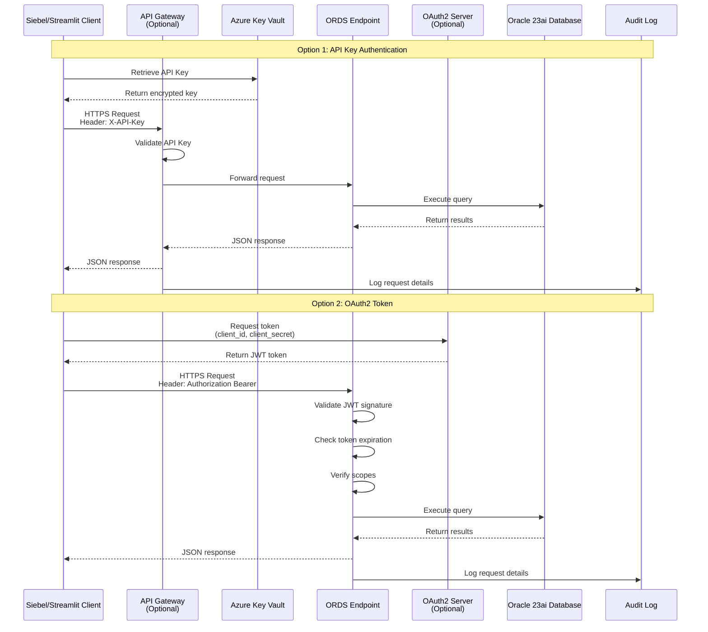

---

## 6. Deployment Architecture

*(This section references the detailed deployment diagrams in the main Project Architecture document)*

### 6.1. CI/CD Pipeline

```mermaid
graph LR
    subgraph Source["Source Control"]
        Git["GitHub Repository<br/>Main Branch"]
        PR["Pull Request<br/>Feature Branch"]
    end
    
    subgraph Build["Build Stage"]
        Checkout["Checkout Code"]
        Lint["Linting<br/>(ESLint, Pylint)"]
        Test["Unit Tests<br/>(Jest, Pytest)"]
        Scan["Security Scan<br/>(Trivy, Snyk)"]
    end
    
    subgraph Artifact["Artifact Stage"]
        DockerBuild["Build Container<br/>(Docker)"]
        Push["Push to ACR"]
        Tag["Tag Version<br/>(Semantic)"]
    end
    
    subgraph Deploy["Deploy Stage"]
        Dev["Deploy to Dev<br/>(Auto)"]
        QA["Deploy to QA<br/>(Manual Approval)"]
        Prod["Deploy to Prod<br/>(Manual Approval)"]
    end
    
    subgraph Monitor["Monitoring"]
        AppInsights["Application Insights"]
        LogAnalytics["Log Analytics"]
        Alerts["Alert Rules"]
    end
    
    PR --> Git
    Git -->|Trigger| Checkout
    Checkout --> Lint
    Lint --> Test
    Test --> Scan
    
    Scan -->|Pass| DockerBuild
    DockerBuild --> Push
    Push --> Tag
    
    Tag --> Dev
    Dev -->|Tests Pass| QA
    QA -->|Approved| Prod
    
    Dev -.->|Metrics| AppInsights
    QA -.->|Metrics| AppInsights
    Prod -.->|Metrics| AppInsights
    
    AppInsights --> LogAnalytics
    LogAnalytics --> Alerts
    
    classDef source fill:#24292E,stroke:#1B1F23,color:#fff
    classDef build fill:#2088FF,stroke:#1366D6,color:#fff
    classDef artifact fill:#68B984,stroke:#3D7A52,color:#fff
    classDef deploy fill:#FFB900,stroke:#C79400,color:#000
    classDef monitor fill:#C74634,stroke:#8B2F23,color:#fff
    
    class Source,Git,PR source
    class Build,Checkout,Lint,Test,Scan build
    class Artifact,DockerBuild,Push,Tag artifact
    class Deploy,Dev,QA,Prod deploy
    class Monitor,AppInsights,LogAnalytics,Alerts monitor
```

---

## 7. Vector Search Architecture

### 7.1. Vector Embedding Process

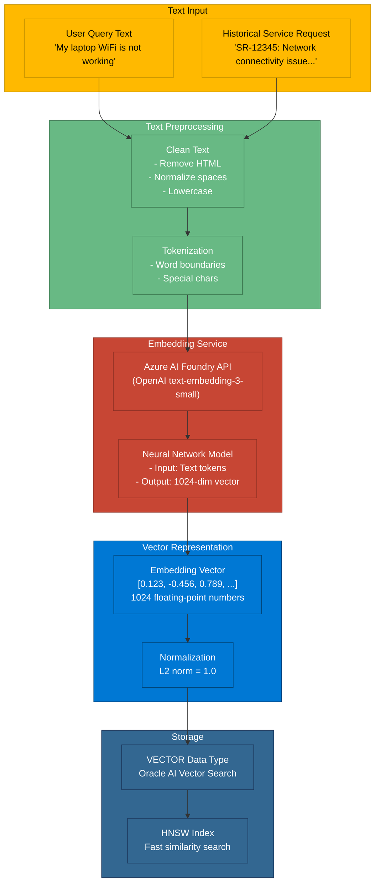

### 7.2. HNSW Index Structure

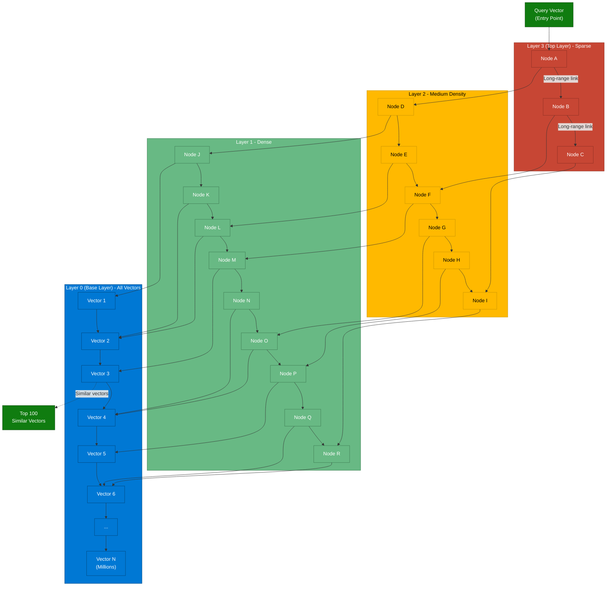

### 7.3. Similarity Search Process

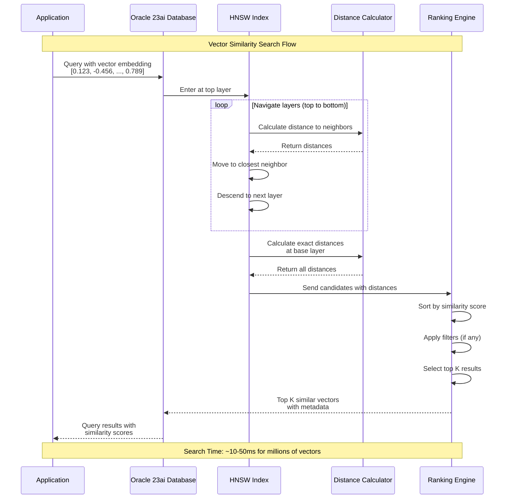

---

## 8. Integration Architecture

### 8.1. Siebel CRM Integration

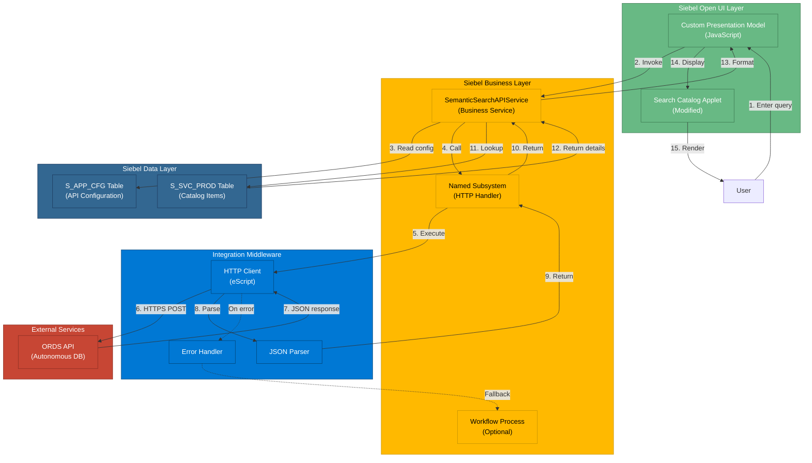

### 8.2. System Integration Points

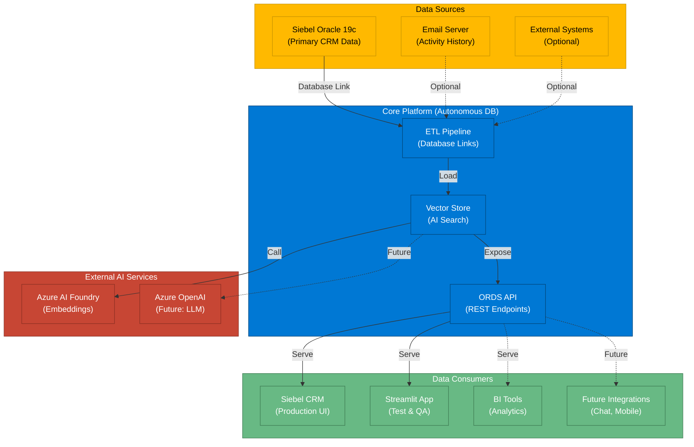

---

## Summary

This document provides comprehensive visual documentation of the semantic search solution architecture, covering:

- **System Context**: Overall system boundaries and major components
- **Component Architecture**: Detailed breakdown of all system components and their interactions
- **Data Flows**: Real-time search and batch indexing processes
- **Network Architecture**: Azure and OCI networking topology with private connectivity
- **Security Architecture**: Multi-layered defense-in-depth security model
- **Deployment Architecture**: CI/CD pipeline and container deployment patterns
- **Vector Search Architecture**: HNSW index structure and similarity search algorithms
- **Integration Architecture**: Siebel CRM integration and external system connections

All diagrams are created using Mermaid syntax and can be rendered in:
- GitHub (native support)
- VS Code (with Mermaid extension)
- Markdown viewers (with Mermaid plugin)
- Documentation platforms (Confluence, GitBook, etc.)

For implementation details, refer to the Technical Design Documents (TDD 1-5).

