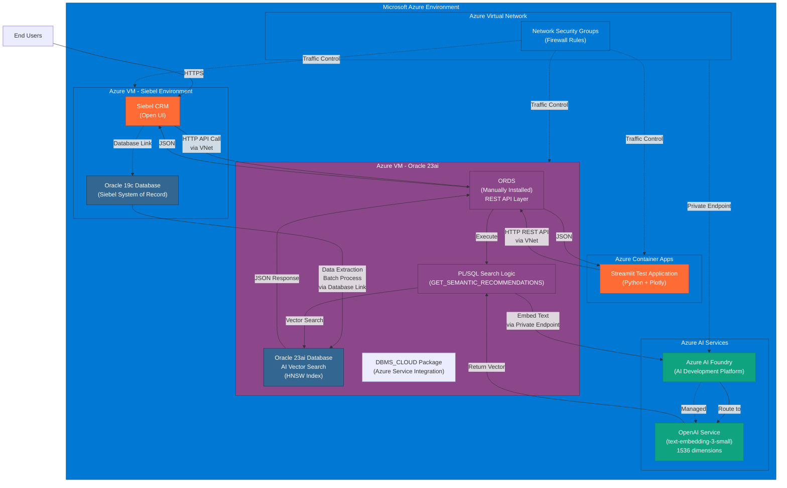
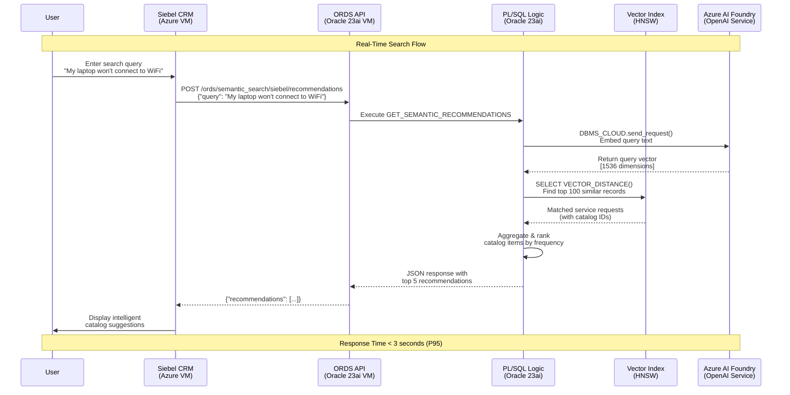
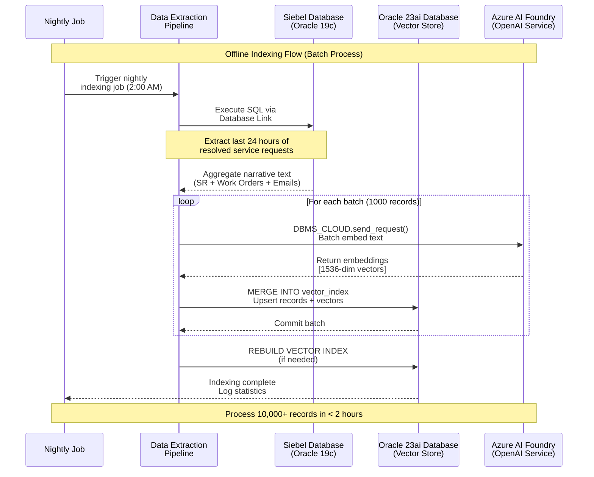
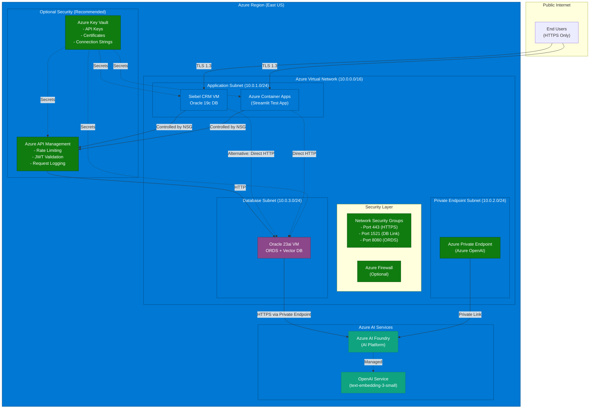
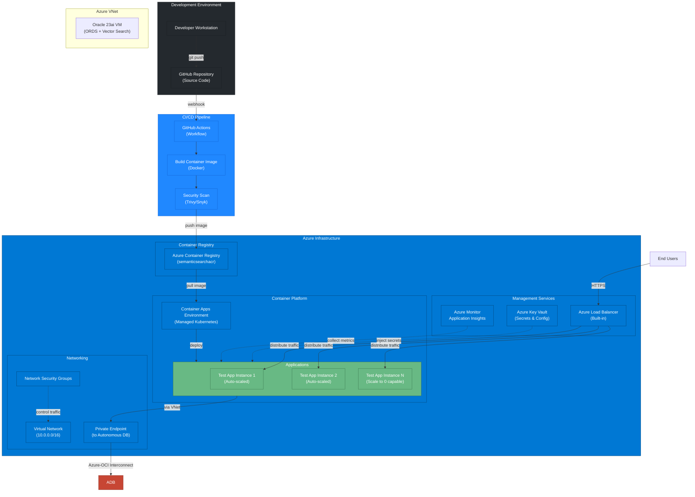
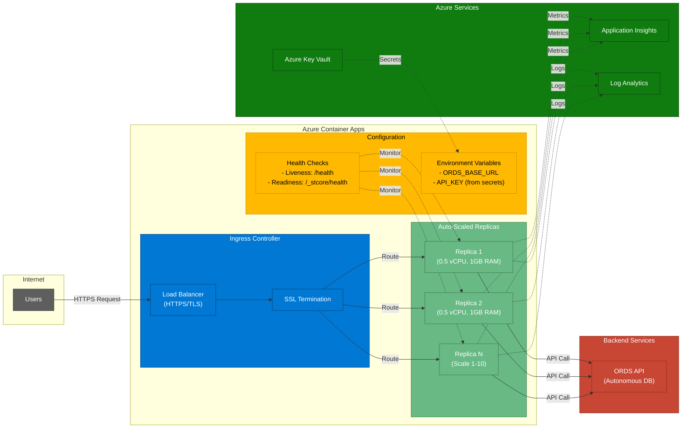

# Project Architecture Guide: AI-Powered Semantic Search for Siebel CRM

**Version:** 2.2
**Date:** 2025-10-17
**Author:** Development Team

## 1. Introduction

### 1.1. Business Problem
The current service catalog search in the Siebel CRM application relies on keyword matching against administrator-defined names and descriptions. With over 10 years of historical data and millions of service requests, this method is inefficient and fails to leverage the rich, contextual information embedded in past user interactions. Users struggle to find the correct catalog item, leading to miscategorized requests, delays in resolution, and a suboptimal user experience.

### 1.2. Proposed Solution
This document outlines the architecture for a modern, AI-powered semantic search engine that replaces the existing keyword search. The new solution will understand the *intent* behind a user's natural language query. It will analyze the user's problem description, compare it to the vast knowledge base of historical service requests, work orders, and email communications, and intelligently recommend the most relevant service catalog items.

## 2. High-Level Architecture

The solution is designed with a simplified, highly performant architecture that integrates with the existing Siebel CRM system. It leverages Oracle REST Data Services (ORDS) to expose the AI search logic directly from the database, eliminating unnecessary network hops and simplifying the technology stack.

### 2.1. System Architecture Diagram



### 2.2. Data Flow Architecture





### 2.3. Component Breakdown

| Component | Technology Stack | Responsibility |
| :--- | :--- | :--- |
| **Data Source** | Oracle 19c (Siebel database) | The existing system of record containing all historical CRM data. |
| **Data Extraction Pipeline** | Database Links, SQL | Extracts, aggregates, and prepares historical data for indexing using direct database-to-database connectivity. Runs as a batch process. |
| **Vector Database** | Oracle Database 23ai on Azure VM | Stores the text narratives and their corresponding vector embeddings. Hosts the high-performance HNSW vector index and the API logic. Self-managed database provides full control over configuration, tuning, and resource allocation. |
| **Embedding Service**| Azure AI Foundry with OpenAI Service (text-embedding-3-small or text-embedding-3-large) | Azure's unified AI development platform that provides managed OpenAI models. Converts text narratives and user queries into numerical vectors (1536 or 3072 dimensions). Accessed from the database via DBMS_CLOUD with Azure Private Endpoint connectivity. Includes prompt flow, evaluation tools, and responsible AI governance. |
| **Semantic Search API** | **Oracle REST Data Services (ORDS) on Oracle 23ai VM & PL/SQL** | A high-performance RESTful API installed and configured on the Oracle 23ai VM. ORDS is manually deployed and managed, typically accessible at http://localhost:8080/ords or http://\<vm-ip\>:8080/ords. The PL/SQL procedure encapsulates all AI search logic including vector similarity search and catalog aggregation. |
| **Siebel CRM** | Siebel Open UI, eScript, Custom Presentation Models | The user-facing application. Modified to call the ORDS endpoint via Named Subsystem and Business Service, displaying intelligent recommendations in the catalog search interface. |
| **Standalone Test App** | Python, Streamlit, Plotly (Azure Container Apps) | A web application for testing and demonstrating the semantic search API independently of Siebel. Provides side-by-side view of matching SRs and recommended catalog paths with analytics. Deployed on Azure Container Apps for cost-effective, auto-scaling hosting. |

### 2.2. Technology Stack Rationale

* **Oracle Database 23ai on Azure VM:** Chosen as a self-managed database solution that delivers enterprise-grade AI Vector Search capabilities with operational flexibility:
    * **Full Control:** Complete control over database configuration, tuning parameters, resource allocation, and version management.
    * **Customization:** Ability to install custom extensions, adjust memory settings, configure storage, and optimize for specific workloads.
    * **Cost Flexibility:** Traditional Oracle licensing (BYOL) or pay-as-you-go options, potentially lower costs than managed services for steady workloads.
    * **Native AI Capabilities:** Oracle 23ai provides built-in AI Vector Search with HNSW indexing, eliminating the need for separate vector databases.
    * **Azure Integration:** Deployed on Azure VMs with VNet connectivity, Network Security Groups, and integration with Azure monitoring and backup services.
    * **Enterprise Features:** Full Oracle Database Enterprise Edition capabilities including RAC, Data Guard, partitioning, and advanced analytics.
    * **Direct Management:** Direct access to database files, logs, and configuration for troubleshooting and optimization.
    
* **Azure AI Foundry with OpenAI Service:** Microsoft's unified AI development platform providing comprehensive AI capabilities:
    * **Unified Platform:** Single platform for prompt engineering, model evaluation, fine-tuning, and deployment
    * **OpenAI Models:** Access to latest OpenAI models (text-embedding-3-small, text-embedding-3-large, GPT-4, etc.)
    * **Better Quality:** 1536 dimensions (text-embedding-3-small) vs 1024 (Cohere), providing 50% more semantic information
    * **Prompt Flow:** Visual designer for building and testing AI workflows
    * **Evaluation Tools:** Built-in tools for testing model performance, quality, and safety
    * **Responsible AI:** Integrated content filtering, monitoring, and governance tools
    * **Cost-Effective:** Competitive pricing at $0.02 per million tokens for embeddings
    * **Azure-Native:** Direct access via Azure Private Endpoints, no cross-cloud communication required
    * **Lower Latency:** In-region Azure connectivity provides <10ms response times
    * **Model Management:** Centralized deployment and versioning of AI models
    * **Enterprise Support:** Full Microsoft Azure SLA and support, integrated with Azure Monitor
    * **Secure Integration:** Seamlessly accessible from Oracle 23ai VM via DBMS_CLOUD with managed identity support
    
* **Oracle REST Data Services (ORDS) on Oracle 23ai VM:** ORDS is manually installed and configured on the Oracle 23ai VM, offering deployment flexibility:
    * **Controlled Deployment:** Full control over ORDS version, configuration, connection pooling, and resource limits.
    * **Performance:** Eliminates the network hop between a separate API layer and the database, resulting in lower latency. The logic lives where the data lives.
    * **Customization:** Ability to customize ORDS settings, add middleware, configure security policies, and integrate with enterprise authentication systems.
    * **Security:** Integration with Oracle Database security model. Authentication and authorization can be customized to match enterprise requirements.
    * **Maintenance:** Manual updates allow for controlled rollout of new ORDS versions, testing in non-production environments first.
    * **Scalability:** Can be deployed standalone or on Tomcat/WebLogic for enterprise-grade load balancing and high availability.

## 3. Data Flow

### 3.1. Offline Indexing Flow (Batch Process)
1.  A scheduled job initiates the **Data Extraction Pipeline**.
2.  An optimized SQL script runs on the **Oracle 19c** database, aggregating text for millions of resolved requests.
3.  The pipeline processes the extracted data, calls **Azure AI Foundry's OpenAI Service** to get vectors, and inserts the data into the **Oracle 23ai Database Vector Store**.
4.  This process runs periodically (e.g., nightly) to keep the search index up-to-date.

### 3.2. Real-Time Search Flow (User Interaction)
1.  A user types a natural language query into the Siebel search UI.
2.  A Siebel eScript makes an HTTP `POST` request to the **ORDS endpoint** (http://localhost:8080/ords or http://\<vm-ip\>:8080/ords), passing the user's query text.
3.  The ORDS listener routes the request to the `GET_SEMANTIC_RECOMMENDATIONS` PL/SQL procedure within the Oracle 23ai Database.
4.  The PL/SQL procedure calls **Azure AI Foundry's OpenAI Service** to convert the user's query into a vector.
5.  The procedure then executes a `VECTOR_DISTANCE` query against the local vector index to find the most similar historical records.
6.  The procedure aggregates the results to find the top 5 most frequently used catalog items.
7.  The procedure formats a JSON response and returns it directly to the Siebel application.
8.  The Siebel eScript parses the JSON and displays the recommended catalog items to the user.

## 4. Non-Functional Requirements

| Category | Requirement | Implementation Strategy |
| :--- | :--- | :--- |
| **Performance** | End-to-end search response time < 3 seconds (P95). | - HNSW vector index in Oracle 23ai Database.<br>- Co-location of API logic and data via ORDS on same VM.<br>- Low-latency connectivity within Azure VNet. |
| **Scalability** | API must handle 50 concurrent users. Indexing must process 10,000+ new records nightly. | - Oracle 23ai optimized for vector search workloads.<br>- ORDS connection pooling and resource management.<br>- Batch processing for the indexing pipeline with parallel execution. |
| **Availability** | The search service should have 99.9% uptime. | - Azure VM availability with managed disks and availability zones.<br>- Oracle Data Guard for high availability (optional).<br>- Graceful degradation in Siebel if the API is unreachable. |
| **Security** | All data in transit must be encrypted. Access to the API and database must be authenticated and authorized. | - TLS 1.2+ for all connections.<br>- ORDS endpoint protection (OAuth2 or API Keys).<br>- Azure Key Vault for credentials used in Azure service callouts. |
| **Maintainability** | The solution must be modular and easy to update. | - Logic is encapsulated in a single, version-controlled PL/SQL package.<br>- Comprehensive logging and monitoring.<br>- VM access for direct troubleshooting and optimization. |

## 5. Security Architecture

### 5.1. Network Security Diagram


    class NSG,Firewall,APIM,KeyVault,PrivateEndpoint security
```

### 5.2. Security Layers

```mermaid
graph LR
    subgraph Layer1["Layer 1: Network Security"]
        NSG["Network Security Groups<br/>- Restrict inbound/outbound<br/>- IP whitelisting"]
        VNet["VNet Connectivity<br/>- Azure Private networking<br/>- No public internet required"]
    end
    
    subgraph Layer2["Layer 2: Transport Security"]
        TLS["TLS 1.3 Encryption<br/>- End-to-end encryption<br/>- Certificate pinning"]
        HTTPS["HTTPS Only<br/>- No HTTP fallback<br/>- HSTS enabled"]
    end
    
    subgraph Layer3["Layer 3: Authentication"]
        OAuth["OAuth2/JWT Tokens<br/>- Token validation<br/>- Short-lived tokens"]
        APIKey["API Key Management<br/>- Stored in Key Vault<br/>- Rotation policy"]
    end
    
    subgraph Layer4["Layer 4: Authorization"]
        RBAC["ORDS Privileges<br/>- Schema-level access<br/>- Endpoint permissions"]
        DBVault["Database Vault<br/>- Command rules<br/>- Separation of duties"]
    end
    
    subgraph Layer5["Layer 5: Data Security"]
        TDE["Transparent Data Encryption<br/>- Automatic encryption<br/>- Key management"]
        Masking["Data Masking<br/>- PII protection<br/>- Redaction policies"]
    end
    
    subgraph Layer6["Layer 6: Monitoring"]
        Audit["Audit Logging<br/>- All API calls logged<br/>- Database activity"]
        Threat["Threat Detection<br/>- Anomaly detection<br/>- Real-time alerts"]
    end
    
    Request["User Request"] --> NSG
    NSG --> PrivateLink
    PrivateLink --> TLS
    TLS --> HTTPS
    HTTPS --> OAuth
    OAuth --> APIKey
    APIKey --> RBAC
    RBAC --> DBVault
    DBVault --> TDE
    TDE --> Masking
    Masking --> Data["Protected Data"]
    
    Audit -.->|Monitor| NSG
    Audit -.->|Monitor| OAuth
    Audit -.->|Monitor| RBAC
    Threat -.->|Alert| Audit
    
    classDef network fill:#0078D4,stroke:#004578,color:#fff
    classDef transport fill:#107C10,stroke:#094509,color:#fff
    classDef auth fill:#FFB900,stroke:#C79400,color:#000
    classDef authz fill:#FF8C00,stroke:#C76D00,color:#fff
    classDef data fill:#E81123,stroke:#A80D1A,color:#fff
    classDef monitor fill:#5E5E5E,stroke:#2E2E2E,color:#fff
    
    class Layer1,NSG,PrivateLink network
    class Layer2,TLS,HTTPS transport
    class Layer3,OAuth,APIKey auth
    class Layer4,RBAC,DBVault authz
    class Layer5,TDE,Masking data
    class Layer6,Audit,Threat monitor
```



### 5.3. Security Implementation
Oracle Database 23ai on Azure VM provides enterprise-grade security with complete administrative control:

1.  **Configurable Encryption:** Transparent Data Encryption (TDE) can be configured for data at rest. TLS 1.2+ for data in transit.
2.  **Database Security Features:** Oracle Database 23ai includes Database Vault, Data Masking, Virtual Private Database (VPD), and Label Security capabilities.
3.  **Manual Security Patching:** Security patches are applied according to enterprise change management processes, with full control over timing and rollout.

### 5.4. Network Security
1.  **VNet Connectivity:** The Oracle 23ai VM is deployed within Azure Virtual Network, accessible only from authorized Azure resources.
2.  **Network Isolation:** Network Security Groups (NSGs) and Azure Firewall rules restrict access to authorized sources only (Siebel VM, Container Apps, administrative workstations).
3.  **ORDS Endpoint Security:** ORDS is configured with TLS 1.2+ support, OAuth2 or API key authentication, and can be integrated with Azure Active Directory.
4.  **Private Endpoint to Azure AI Foundry:** Azure AI Foundry (hosting OpenAI Service) is accessed via Azure Private Endpoint, ensuring embedding requests never traverse the public internet.
5.  **API Gateway (Optional):** For additional security layers, Azure API Management can be placed in front of the ORDS endpoint for rate limiting, JWT validation, and request logging.

### 5.5. Authentication and Authorization
1.  **Schema-Level Security:** ORDS endpoints are secured using ORDS-native privileges or OAuth2 authentication mechanisms.
2.  **API Key Authentication:** Siebel authenticates to the ORDS endpoint using API keys managed within the Oracle database or Azure Key Vault.
3.  **Database User Privileges:** The SEMANTIC_SEARCH schema has minimal privileges, following the principle of least privilege.

### 5.6. Callout Security
The PL/SQL procedure's callout to Azure AI Foundry (OpenAI Service) is secured using a `DBMS_CLOUD` credential, which stores Azure service principal credentials or API keys encrypted within the database or retrieved from Azure Key Vault.

## 6. Standalone Test Application

### 6.1. Purpose and Benefits

The Standalone Test Application is a Python-based web application built with Streamlit that provides an independent testing and demonstration platform for the semantic search functionality. This application is essential for:

- **Pre-Siebel Testing**: Validate search functionality before full Siebel integration
- **Rapid Development**: Test API changes without redeploying Siebel components
- **QA Validation**: Execute systematic test cases with golden set queries
- **Stakeholder Demos**: Showcase semantic search capabilities to business users
- **Performance Analysis**: Measure and visualize response times and search patterns
- **Training**: Help users understand semantic search behavior

### 6.2. Key Features

The test application provides a rich user interface with the following capabilities:

**Search Interface**:
- Natural language query input with configurable Top-K parameter
- Real-time search execution with response time display
- Search history with replay functionality
- Batch query testing from CSV files

**Results Visualization**:
- **Left Panel**: Matching service requests with similarity scores, narratives, and catalog paths
- **Right Panel**: Recommended catalog paths with frequency counts and percentages
- Interactive expandable sections for detailed information
- Visual progress bars for similarity scores and recommendation percentages

**Analytics Dashboard**:
- Similarity score distribution histogram
- Catalog path frequency bar chart
- Response time trend analysis over search history
- Aggregate statistics (average similarity, median, standard deviation)

**Export Capabilities**:
- Export results to CSV for spreadsheet analysis
- Export results to JSON for programmatic processing
- Export search history with timestamps
- Download golden set test results

### 6.3. Architecture

```
┌─────────────────────────────────────────────────────────────┐
│                    Streamlit Web UI                          │
│  ┌────────────┐  ┌──────────────┐  ┌────────────────────┐  │
│  │Search Panel│  │Results Panel │  │Analytics Dashboard │  │
│  └────────────┘  └──────────────┘  └────────────────────┘  │
└────────────────────────┬────────────────────────────────────┘
                         │
                         ▼
┌─────────────────────────────────────────────────────────────┐
│              Python Application Logic                        │
│  ┌──────────────┐  ┌──────────────┐  ┌─────────────────┐  │
│  │ORDS API      │  │Data Processor│  │Cache Manager    │  │
│  │Client        │  │              │  │                 │  │
│  └──────────────┘  └──────────────┘  └─────────────────┘  │
└─────────────────────────┬───────────────────────────────────┘
                          │
          ┌───────────────┴───────────────┐
          ▼                               ▼
┌─────────────────────┐         ┌──────────────────────────┐
│  ORDS REST API      │         │  Oracle Autonomous DB    │
│  (Primary Mode)     │         │  on Azure (Optional      │
│  Pre-configured     │         │  Direct Connection)      │
└─────────────────────┘         └──────────────────────────┘
```

### 6.4. Technology Stack

| Technology | Version | Purpose |
|-----------|---------|---------|
| Streamlit | 1.28+ | Web application framework for rapid UI development |
| requests | 2.31+ | HTTP client for ORDS REST API communication |
| pandas | 2.1+ | Data manipulation and analysis |
| plotly | 5.18+ | Interactive visualizations and charts |
| oracledb | 1.4+ | Optional direct database connectivity |
| python-dotenv | 1.0+ | Environment variable management |

### 6.5. Usage Scenarios

**Scenario 1: Developer Testing**
- Developers use the test app to validate new embedding models or algorithm changes
- Execute standard test queries and compare results with baseline
- Export results for detailed analysis in spreadsheets

**Scenario 2: QA Validation**
- QA loads golden set test queries from CSV file
- Executes batch testing to validate search relevance
- Calculates Precision@3 metric automatically
- Exports results for test report generation

**Scenario 3: Business Demonstration**
- Product owners demonstrate semantic search to stakeholders
- Use realistic business queries to show relevance
- Display analytics dashboard showing performance metrics
- Compare "before and after" scenarios

**Scenario 4: Performance Testing**
- Performance testers execute series of searches with timestamps
- Analytics panel shows response time trends
- Identify slow queries and performance bottlenecks
- Export timing data for performance reports

### 6.6. Configuration

The test application is configured via environment variables in a `.env` file:

```ini
# API Configuration
ORDS_BASE_URL=https://<unique_id>-<db_name>.adb.<region>.oraclecloudapps.com/ords
API_KEY=your_secure_api_key

# Application Settings
DEFAULT_TOP_K=5
CACHE_ENABLED=true
ENABLE_DATABASE_MODE=false  # Set to true for direct DB queries
LOG_LEVEL=INFO
```

### 6.7. Deployment Options

#### Deployment Architecture Diagram



#### Container Apps Architecture



#### Local Development

**Run locally for testing**:
```bash
streamlit run app.py --server.port 8501
```

#### Azure Container Apps Deployment (Recommended)

**Build and push container**:
```bash
# Build container image
docker build -t semantic-search-test-app .

# Login to Azure Container Registry
az acr login --name <your-registry>

# Tag and push image
docker tag semantic-search-test-app <your-registry>.azurecr.io/semantic-search-test-app:latest
docker push <your-registry>.azurecr.io/semantic-search-test-app:latest
```

**Deploy to Azure Container Apps**:
```bash
az containerapp create \
  --name semantic-search-test \
  --resource-group <your-rg> \
  --environment <your-env> \
  --image <your-registry>.azurecr.io/semantic-search-test-app:latest \
  --target-port 8501 \
  --ingress external \
  --min-replicas 1 \
  --max-replicas 3 \
  --cpu 0.5 \
  --memory 1.0Gi \
  --env-vars-file .env
```

#### Azure App Service Deployment (Alternative)

**Deploy using Azure CLI**:
```bash
az webapp up \
  --name semantic-search-test-app \
  --resource-group <your-rg> \
  --runtime PYTHON:3.11 \
  --sku B1
```

#### Benefits of Azure Deployment

| Benefit | Description |
|---------|-------------|
| **Unified Infrastructure** | Entire solution stays within Azure (Siebel VM + Oracle 23ai VM + Test App) |
| **VNet Connectivity** | VNet integration enables secure private access to Oracle 23ai VM |
| **Auto-Scaling** | Container Apps automatically scales 1-10 replicas based on traffic |
| **Cost Optimization** | Scale to zero when not in use; pay only for actual consumption |
| **Azure AD Integration** | Centralized authentication and access control |
| **Monitoring** | Integrated with Azure Monitor and Application Insights |
| **High Availability** | Built-in load balancing and health checks |
| **CI/CD Ready** | Native GitHub Actions integration for automated deployments |

### 6.8. Documentation

Complete technical specifications for the Standalone Test Application are available in [TDD 5: Standalone Test Application](TDD%205%20-%20Standalone%20Test%20Application.md), including:

- Detailed component specifications
- API client implementation
- UI component designs
- Error handling strategies
- Security considerations
- Troubleshooting guide
- Future enhancements

