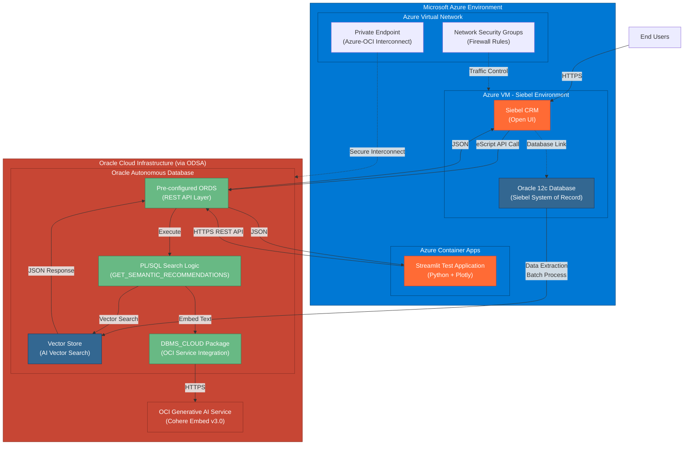
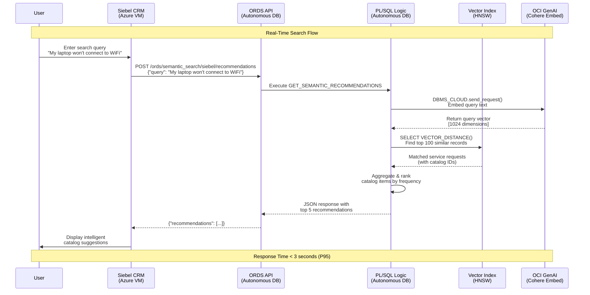
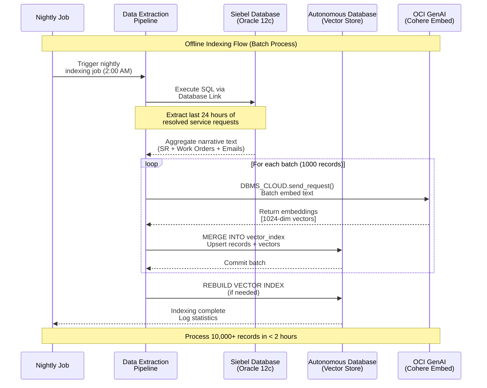
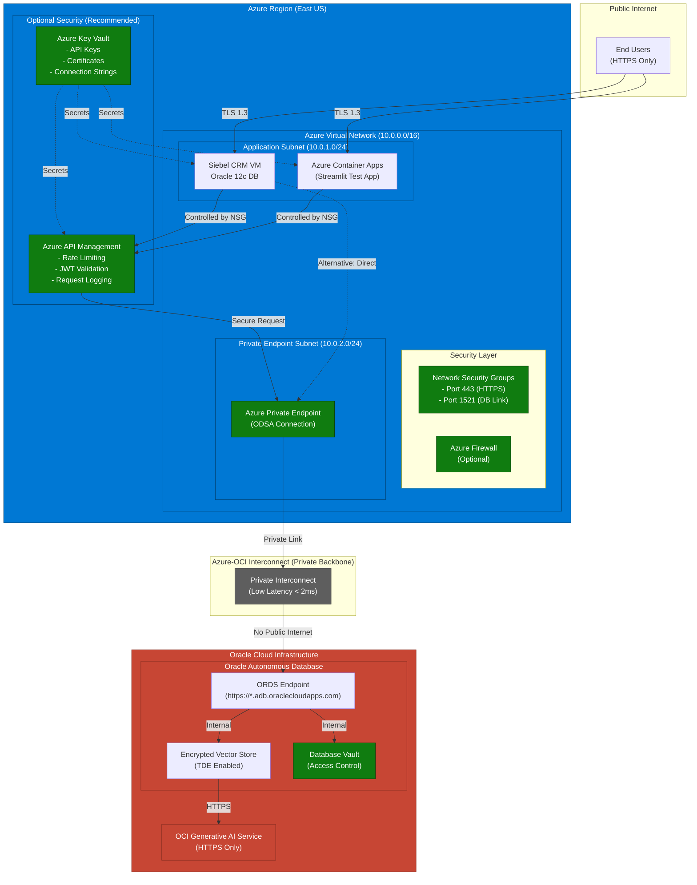
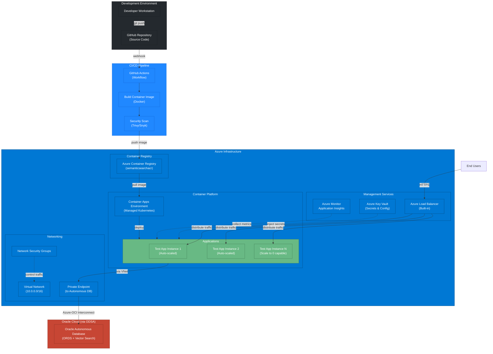
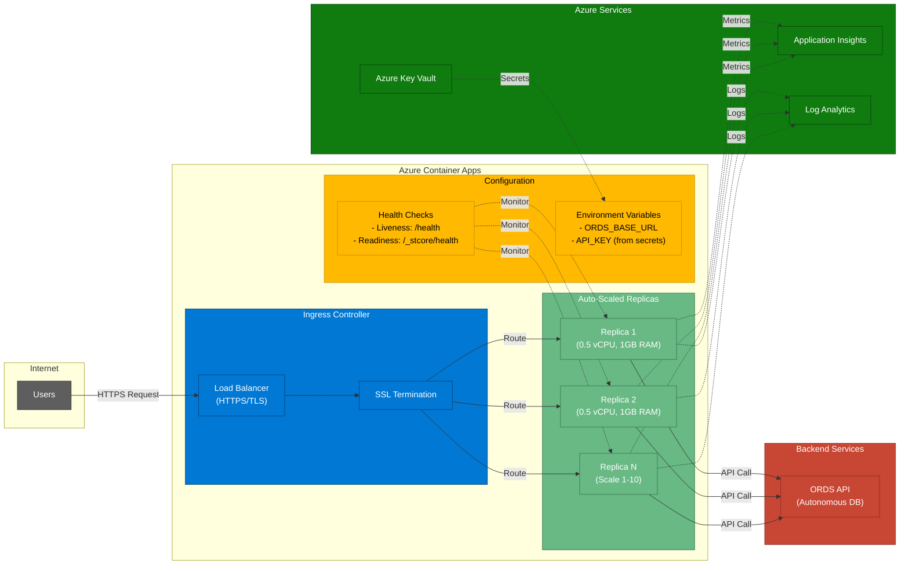

# Project Architecture Guide: AI-Powered Semantic Search for Siebel CRM

**Version:** 2.2
**Date:** 2025-10-17
**Author:** Development Team

## 1. Introduction

### 1.1. Business Problem
The current service catalog search in the Siebel CRM application relies on keyword matching against administrator-defined names and descriptions. With over 10 years of historical data and millions of service requests, this method is inefficient and fails to leverage the rich, contextual information embedded in past user interactions. Users struggle to find the correct catalog item, leading to miscategorized requests, delays in resolution, and a suboptimal user experience.

### 1.2. Proposed Solution
This document outlines the architecture for a modern, AI-powered semantic search engine that replaces the existing keyword search. The new solution will understand the *intent* behind a user's natural language query. It will analyze the user's problem description, compare it to the vast knowledge base of historical service requests, work orders, and email communications, and intelligently recommend the most relevant service catalog items.

## 2. High-Level Architecture

The solution is designed with a simplified, highly performant architecture that integrates with the existing Siebel CRM system. It leverages Oracle REST Data Services (ORDS) to expose the AI search logic directly from the database, eliminating unnecessary network hops and simplifying the technology stack.

### 2.1. System Architecture Diagram



### 2.2. Data Flow Architecture





### 2.3. Component Breakdown

| Component | Technology Stack | Responsibility |
| :--- | :--- | :--- |
| **Data Source** | Oracle 12c (Siebel DB) | The existing system of record containing all historical CRM data. |
| **Data Extraction Pipeline** | Database Links, SQL | Extracts, aggregates, and prepares historical data for indexing using direct database-to-database connectivity. Runs as a batch process. |
| **Vector Database** | Oracle Autonomous Database on Azure (Serverless) | Stores the text narratives and their corresponding vector embeddings. Hosts the high-performance HNSW vector index and the API logic. Fully managed PaaS solution with automated patching, backups, and scaling. |
| **Embedding Service**| OCI Generative AI Service (Cohere Embed v3.0) | A managed cloud service that converts text narratives and user queries into numerical vectors (1024 dimensions), called from within the database via DBMS_CLOUD. |
| **Semantic Search API** | **Built-in Oracle REST Data Services (ORDS) on Autonomous Database & PL/SQL** | A high-performance RESTful API hosted directly by the Oracle Autonomous Database. ORDS comes pre-installed and pre-configured, eliminating deployment overhead. The PL/SQL procedure encapsulates all AI search logic including vector similarity search and catalog aggregation. |
| **Siebel CRM** | Siebel Open UI, eScript, Custom Presentation Models | The user-facing application. Modified to call the ORDS endpoint via Named Subsystem and Business Service, displaying intelligent recommendations in the catalog search interface. |
| **Standalone Test App** | Python, Streamlit, Plotly | A web application for testing and demonstrating the semantic search API independently of Siebel. Provides side-by-side view of matching SRs and recommended catalog paths with analytics. See [TDD 5](TDD%205%20-%20Standalone%20Test%20Application.md) for complete specifications. |

### 2.2. Technology Stack Rationale

* **Oracle Autonomous Database on Azure:** Chosen as a fully managed, serverless PaaS solution that delivers enterprise-grade AI Vector Search capabilities with significant operational advantages:
    * **Reduced Administrative Overhead:** Eliminates manual database patching, backups, and performance tuning. The service automatically manages these tasks.
    * **Enhanced Security:** Built-in security features including automatic encryption, threat detection, and data masking are configured out-of-the-box.
    * **High Availability:** 99.95% SLA with automated failover and disaster recovery capabilities built into the service.
    * **Serverless Elasticity:** Automatically scales compute and storage resources based on workload demands.
    * **Low-Latency Azure Integration:** Deployed via Oracle Database Service for Azure (ODSA), providing a private, high-speed interconnect between Azure and OCI data centers for optimal performance.
    * **Cost Efficiency:** Pay only for actual consumption with serverless pricing model, eliminating over-provisioning costs.
    
* **Built-in Oracle REST Data Services (ORDS):** ORDS comes pre-installed and pre-configured in Autonomous Database, offering significant deployment advantages:
    * **Zero Installation:** No need to download, install, or configure ORDS separately. It's ready to use immediately.
    * **Performance:** Eliminates the network hop between a separate API layer and the database, resulting in lower latency. The logic lives where the data lives.
    * **Simplicity:** Drastically reduces deployment complexity and time-to-production. No separate infrastructure to manage.
    * **Security:** Fully integrated with Autonomous Database security model. Authentication is handled within the managed service.
    * **Automatic Updates:** ORDS is automatically updated as part of the Autonomous Database service.
    
* **OCI Generative AI Service:** Provides access to state-of-the-art embedding models without the overhead of hosting and managing them. Seamlessly accessible from Autonomous Database via DBMS_CLOUD.

## 3. Data Flow

### 3.1. Offline Indexing Flow (Batch Process)
1.  A scheduled job initiates the **Data Extraction Pipeline**.
2.  An optimized SQL script runs on the **Oracle 12c** database, aggregating text for millions of resolved requests.
3.  The pipeline processes the extracted data, calls the **OCI Embedding Service** to get vectors, and inserts the data into the **Oracle Autonomous Database Vector Store**.
4.  This process runs periodically (e.g., nightly) to keep the search index up-to-date.

### 3.2. Real-Time Search Flow (User Interaction)
1.  A user types a natural language query into the Siebel search UI.
2.  A Siebel eScript makes an HTTPS `POST` request to the **managed ORDS endpoint**, passing the user's query text.
3.  The pre-configured ORDS listener routes the request to the `GET_SEMANTIC_RECOMMENDATIONS` PL/SQL procedure within the Oracle Autonomous Database.
4.  The PL/SQL procedure calls the **OCI Embedding Service** to convert the user's query into a vector.
5.  The procedure then executes a `VECTOR_DISTANCE` query against the local vector index to find the most similar historical records.
6.  The procedure aggregates the results to find the top 5 most frequently used catalog items.
7.  The procedure formats a JSON response and returns it directly to the Siebel application.
8.  The Siebel eScript parses the JSON and displays the recommended catalog items to the user.

## 4. Non-Functional Requirements

| Category | Requirement | Implementation Strategy |
| :--- | :--- | :--- |
| **Performance** | End-to-end search response time < 3 seconds (P95). | - HNSW vector index in Oracle Autonomous Database.<br>- Co-location of API logic and data via pre-configured ORDS.<br>- Low-latency private interconnect between Azure and OCI via ODSA. |
| **Scalability** | API must handle 50 concurrent users. Indexing must process 10,000+ new records nightly. | - Autonomous Database and ORDS automatically scale based on workload.<br>- Serverless architecture eliminates manual capacity planning.<br>- Batch processing for the indexing pipeline. |
| **Availability** | The search service should have 99.9% uptime (99.95% SLA provided). | - Built-in high availability with automated failover and disaster recovery.<br>- No manual DBA intervention required for maintenance.<br>- Graceful degradation in Siebel if the API is unreachable. |
| **Security** | All data in transit must be encrypted. Access to the API and database must be authenticated and authorized. | - TLS 1.2+ for all connections.<br>- ORDS endpoint protection (OAuth2 or Gateway API Keys).<br>- OCI Credentials stored securely within the database for callouts. |
| **Maintainability** | The solution must be modular and easy to update. | - Logic is encapsulated in a single, version-controlled PL/SQL package.<br>- Comprehensive logging and monitoring. |

## 5. Security Architecture

### 5.1. Network Security Diagram



### 5.2. Security Layers

```mermaid
graph LR
    subgraph Layer1["Layer 1: Network Security"]
        NSG["Network Security Groups<br/>- Restrict inbound/outbound<br/>- IP whitelisting"]
        PrivateLink["Private Connectivity<br/>- Azure-OCI backbone<br/>- No public internet"]
    end
    
    subgraph Layer2["Layer 2: Transport Security"]
        TLS["TLS 1.3 Encryption<br/>- End-to-end encryption<br/>- Certificate pinning"]
        HTTPS["HTTPS Only<br/>- No HTTP fallback<br/>- HSTS enabled"]
    end
    
    subgraph Layer3["Layer 3: Authentication"]
        OAuth["OAuth2/JWT Tokens<br/>- Token validation<br/>- Short-lived tokens"]
        APIKey["API Key Management<br/>- Stored in Key Vault<br/>- Rotation policy"]
    end
    
    subgraph Layer4["Layer 4: Authorization"]
        RBAC["ORDS Privileges<br/>- Schema-level access<br/>- Endpoint permissions"]
        DBVault["Database Vault<br/>- Command rules<br/>- Separation of duties"]
    end
    
    subgraph Layer5["Layer 5: Data Security"]
        TDE["Transparent Data Encryption<br/>- Automatic encryption<br/>- Key management"]
        Masking["Data Masking<br/>- PII protection<br/>- Redaction policies"]
    end
    
    subgraph Layer6["Layer 6: Monitoring"]
        Audit["Audit Logging<br/>- All API calls logged<br/>- Database activity"]
        Threat["Threat Detection<br/>- Anomaly detection<br/>- Real-time alerts"]
    end
    
    Request["User Request"] --> NSG
    NSG --> PrivateLink
    PrivateLink --> TLS
    TLS --> HTTPS
    HTTPS --> OAuth
    OAuth --> APIKey
    APIKey --> RBAC
    RBAC --> DBVault
    DBVault --> TDE
    TDE --> Masking
    Masking --> Data["Protected Data"]
    
    Audit -.->|Monitor| NSG
    Audit -.->|Monitor| OAuth
    Audit -.->|Monitor| RBAC
    Threat -.->|Alert| Audit
    
    classDef network fill:#0078D4,stroke:#004578,color:#fff
    classDef transport fill:#107C10,stroke:#094509,color:#fff
    classDef auth fill:#FFB900,stroke:#C79400,color:#000
    classDef authz fill:#FF8C00,stroke:#C76D00,color:#fff
    classDef data fill:#E81123,stroke:#A80D1A,color:#fff
    classDef monitor fill:#5E5E5E,stroke:#2E2E2E,color:#fff
    
    class Layer1,NSG,PrivateLink network
    class Layer2,TLS,HTTPS transport
    class Layer3,OAuth,APIKey auth
    class Layer4,RBAC,DBVault authz
    class Layer5,TDE,Masking data
    class Layer6,Audit,Threat monitor
```



### 5.3. Managed Security Advantages
Oracle Autonomous Database on Azure provides enterprise-grade security with significantly reduced administrative overhead:

1.  **Automatic Encryption:** All data is encrypted at rest and in transit by default. Transparent Data Encryption (TDE) is automatically enabled without manual configuration.
2.  **Built-in Threat Detection:** Autonomous Database includes Database Vault and Data Masking capabilities for protecting sensitive data.
3.  **Automated Security Patching:** Critical security patches are applied automatically during maintenance windows, eliminating manual patching cycles.

### 5.4. Network Security
1.  **Private Connectivity:** The Oracle Autonomous Database is accessible via private endpoints through the Azure-OCI interconnect (ODSA), ensuring traffic never traverses the public internet.
2.  **Network Isolation:** Network Security Groups (NSGs) and firewall rules restrict access to authorized Azure resources only.
3.  **Managed ORDS Endpoint:** The built-in ORDS endpoint is accessed through secure TLS 1.2+ connections, with certificate management handled by the service.
4.  **API Gateway (Optional):** For additional security layers, an Azure API Management or OCI API Gateway can be placed in front of the ORDS endpoint.

### 5.3. Authentication and Authorization
1.  **Schema-Level Security:** ORDS endpoints are secured using ORDS-native privileges or OAuth2 authentication mechanisms.
2.  **API Key Authentication:** Siebel authenticates to the ORDS endpoint using API keys managed within the Autonomous Database security model.
3.  **Database User Privileges:** The SEMANTIC_SEARCH schema has minimal privileges, following the principle of least privilege.

### 5.4. Callout Security
The PL/SQL procedure's callout to the OCI Embedding Service is secured using a `DBMS_CLOUD` credential, which stores OCI API keys encrypted within the Autonomous Database, eliminating the need for external credential files or vaults.

## 6. Standalone Test Application

### 6.1. Purpose and Benefits

The Standalone Test Application is a Python-based web application built with Streamlit that provides an independent testing and demonstration platform for the semantic search functionality. This application is essential for:

- **Pre-Siebel Testing**: Validate search functionality before full Siebel integration
- **Rapid Development**: Test API changes without redeploying Siebel components
- **QA Validation**: Execute systematic test cases with golden set queries
- **Stakeholder Demos**: Showcase semantic search capabilities to business users
- **Performance Analysis**: Measure and visualize response times and search patterns
- **Training**: Help users understand semantic search behavior

### 6.2. Key Features

The test application provides a rich user interface with the following capabilities:

**Search Interface**:
- Natural language query input with configurable Top-K parameter
- Real-time search execution with response time display
- Search history with replay functionality
- Batch query testing from CSV files

**Results Visualization**:
- **Left Panel**: Matching service requests with similarity scores, narratives, and catalog paths
- **Right Panel**: Recommended catalog paths with frequency counts and percentages
- Interactive expandable sections for detailed information
- Visual progress bars for similarity scores and recommendation percentages

**Analytics Dashboard**:
- Similarity score distribution histogram
- Catalog path frequency bar chart
- Response time trend analysis over search history
- Aggregate statistics (average similarity, median, standard deviation)

**Export Capabilities**:
- Export results to CSV for spreadsheet analysis
- Export results to JSON for programmatic processing
- Export search history with timestamps
- Download golden set test results

### 6.3. Architecture

```
┌─────────────────────────────────────────────────────────────┐
│                    Streamlit Web UI                          │
│  ┌────────────┐  ┌──────────────┐  ┌────────────────────┐  │
│  │Search Panel│  │Results Panel │  │Analytics Dashboard │  │
│  └────────────┘  └──────────────┘  └────────────────────┘  │
└────────────────────────┬────────────────────────────────────┘
                         │
                         ▼
┌─────────────────────────────────────────────────────────────┐
│              Python Application Logic                        │
│  ┌──────────────┐  ┌──────────────┐  ┌─────────────────┐  │
│  │ORDS API      │  │Data Processor│  │Cache Manager    │  │
│  │Client        │  │              │  │                 │  │
│  └──────────────┘  └──────────────┘  └─────────────────┘  │
└─────────────────────────┬───────────────────────────────────┘
                          │
          ┌───────────────┴───────────────┐
          ▼                               ▼
┌─────────────────────┐         ┌──────────────────────────┐
│  ORDS REST API      │         │  Oracle Autonomous DB    │
│  (Primary Mode)     │         │  on Azure (Optional      │
│  Pre-configured     │         │  Direct Connection)      │
└─────────────────────┘         └──────────────────────────┘
```

### 6.4. Technology Stack

| Technology | Version | Purpose |
|-----------|---------|---------|
| Streamlit | 1.28+ | Web application framework for rapid UI development |
| requests | 2.31+ | HTTP client for ORDS REST API communication |
| pandas | 2.1+ | Data manipulation and analysis |
| plotly | 5.18+ | Interactive visualizations and charts |
| oracledb | 1.4+ | Optional direct database connectivity |
| python-dotenv | 1.0+ | Environment variable management |

### 6.5. Usage Scenarios

**Scenario 1: Developer Testing**
- Developers use the test app to validate new embedding models or algorithm changes
- Execute standard test queries and compare results with baseline
- Export results for detailed analysis in spreadsheets

**Scenario 2: QA Validation**
- QA loads golden set test queries from CSV file
- Executes batch testing to validate search relevance
- Calculates Precision@3 metric automatically
- Exports results for test report generation

**Scenario 3: Business Demonstration**
- Product owners demonstrate semantic search to stakeholders
- Use realistic business queries to show relevance
- Display analytics dashboard showing performance metrics
- Compare "before and after" scenarios

**Scenario 4: Performance Testing**
- Performance testers execute series of searches with timestamps
- Analytics panel shows response time trends
- Identify slow queries and performance bottlenecks
- Export timing data for performance reports

### 6.6. Configuration

The test application is configured via environment variables in a `.env` file:

```ini
# API Configuration
ORDS_BASE_URL=https://<unique_id>-<db_name>.adb.<region>.oraclecloudapps.com/ords
API_KEY=your_secure_api_key

# Application Settings
DEFAULT_TOP_K=5
CACHE_ENABLED=true
ENABLE_DATABASE_MODE=false  # Set to true for direct DB queries
LOG_LEVEL=INFO
```

### 6.7. Deployment Options

#### Deployment Architecture Diagram



#### Container Apps Architecture



#### Local Development

**Run locally for testing**:
```bash
streamlit run app.py --server.port 8501
```

#### Azure Container Apps Deployment (Recommended)

**Build and push container**:
```bash
# Build container image
docker build -t semantic-search-test-app .

# Login to Azure Container Registry
az acr login --name <your-registry>

# Tag and push image
docker tag semantic-search-test-app <your-registry>.azurecr.io/semantic-search-test-app:latest
docker push <your-registry>.azurecr.io/semantic-search-test-app:latest
```

**Deploy to Azure Container Apps**:
```bash
az containerapp create \
  --name semantic-search-test \
  --resource-group <your-rg> \
  --environment <your-env> \
  --image <your-registry>.azurecr.io/semantic-search-test-app:latest \
  --target-port 8501 \
  --ingress external \
  --min-replicas 1 \
  --max-replicas 3 \
  --cpu 0.5 \
  --memory 1.0Gi \
  --env-vars-file .env
```

#### Azure App Service Deployment (Alternative)

**Deploy using Azure CLI**:
```bash
az webapp up \
  --name semantic-search-test-app \
  --resource-group <your-rg> \
  --runtime PYTHON:3.11 \
  --sku B1
```

#### Benefits of Azure Deployment

| Benefit | Description |
|---------|-------------|
| **Unified Infrastructure** | Entire solution stays within Azure (Siebel VM + ADB + Test App) |
| **Private Connectivity** | VNet integration enables secure private access to Autonomous Database |
| **Auto-Scaling** | Container Apps automatically scales 1-10 replicas based on traffic |
| **Cost Optimization** | Scale to zero when not in use; pay only for actual consumption |
| **Azure AD Integration** | Centralized authentication and access control |
| **Monitoring** | Integrated with Azure Monitor and Application Insights |
| **High Availability** | Built-in load balancing and health checks |
| **CI/CD Ready** | Native GitHub Actions integration for automated deployments |

### 6.8. Documentation

Complete technical specifications for the Standalone Test Application are available in [TDD 5: Standalone Test Application](TDD%205%20-%20Standalone%20Test%20Application.md), including:

- Detailed component specifications
- API client implementation
- UI component designs
- Error handling strategies
- Security considerations
- Troubleshooting guide
- Future enhancements

